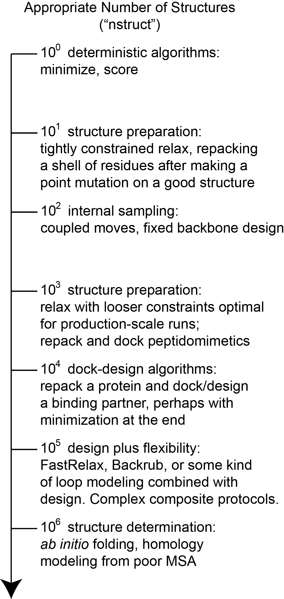

Rosetta is a very hungry program in terms of computer time.
This is partly because protein modeling is about the [[hardest problem|http://xkcd.com/1430/]] we know.
It is partly because Rosetta is largely written by professional biophysicists who are less experienced at software engineering and totally inexperienced with [[optimizing|https://en.wikipedia.org/wiki/Program_optimization]] algorithms for speed.
(That said, the [[inner loops|https://en.wikipedia.org/wiki/Inner_loop]] really are quite optimized by people who knew what they were doing!)

This page talks about Rosetta in terms of both `nstruct`—the Rosetta flag to control the **n**umber of **struct**ures generated—and the computer time needed to generate those structures.
Ideally, one always runs enough models to sample enough of the search space to answer their modeling question.
In the real world, experimenters are constrained by computer time.
Additionally, the question of how many nstruct are necessary is heuristic and specific to the problem.
This document attempts to address in a harder sense how many nstruct models one wants for different types of experiments (and why!), and in a softer sense approximately how much computer time we are talking about.
The [[results analysis|Analyzing-Results]] page also addresses the issue.

The diagram sketches out different experiments available on a logarithmic nstruct scale.
Assume computer time is positively correlated with nstruct.

TODO: ask Elizabeth to image map this

100
------------------
At this logarithmic scale, one single model, we can use Rosetta protocols that are deterministic: protocols that are not employing a Monte Carlo search.
The notable entries here are [[scoring]] and [[minimization]].
Running the minimizer directly on an input structure is relatively rare (it will immediately get trapped in a local minimum) but plausible.
Scoring a structure is a very common event.
This scale will generally be fast and can run on a laptop.

101
------------------
At this scale, we can consider protocols that are intended to have a very small search space and those that can be completely sampled.
10 to 100 models are reasonable for most [[structure preparation]] efforts, because these efforts are meant to be tightly constrained to the starting model, only fixing serious errors.
This range is also reasonable for minor [[repacking|fixbb]] experiments.
Repacking is feasible because it samples *very extensively* inside the protocol, so relatively few nstruct are needed.
This scale will generally be fast and can run on a laptop.

102
------------------
At this scale, we can consider smaller experiments sampling mostly non-backbone internal degrees of freedom: the sidechains.
Sampling only the sidechains leads to a relatively small and less frustrated search space, partly because very few atoms move at a time and there are never large concerted (or unconcerted) movements of many atoms.
The archetypical application here is [[fixed backbone design|fixbb]].
Again, fixbb can run on small scales because the guts of the packing algorithm are very optimized and run many cycles internally.
Fixbb generally fast and runs on a laptop, although large design jobs may require more memory than less powerful computers will have.

Coupled moves, available as an executable (coupled_moves) or a RosettaScripts mover (CoupledMover), incorporates a limited amount of coupled (hence the name) backbone and sidechain flexibility via the BackrubMover; it also has facilities for ligand manipulation.
Importantly, it uses the BoltzmannRotamerMover to select rotamers for each position, rather than the packer, which improves speed and can lead to greater sequence diversity, making it a great choice for diversifying one's starting structure.
Because it considers and discards many solutions per eventually produced decoy, relatively few decoys are needed, though the time needed to produce each one is considerably longer than all but the largest fixbb jobs.
Again, note the trend toward repeated sampling *inside* a trajectory.

103
------------------
At this scale, we begin to consider experiments that introduce non-sidechain degrees of freedom.
Introducing backbone flexibility is very expensive in terms of search space, so we next introduce rigid-body freedoms instead, allowing for small docking problems.  ANDY TODO: peptidomimetics?
This scale is also useful for moderately constrained [[relax]] runs used as part of [[structure preparation]] or at the tail end of [[ab initio structure prediction]].
In this regime, you will generally want something more powerful than your desktop computer: either a many-core lab workhorse or a small run on a lab-scale cluster.

104
------------------
At this scale, we are able to start seriously sampling larger scale docking problems while repacking and even redesigning. JELLY TODO: global vs local docking?  These sorts of problems you will need serious hardware to run: either long periods of time (overnight to days) on lab workhorses, small runs on lab-scale clusters (hundreds of CPUs), or tiny runs on large supercomputers.

