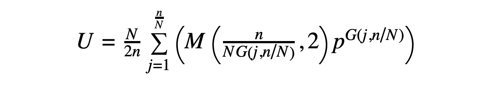

# Count Cyclic Peptide Sequences (count_cycpep_sequences) Application

Back to [[Application Documentation]].

Created 16 August 2019 by Vikram K. Mulligan, Flatiron Institute (vmulligan@flatironinstitute.org).  Approach derived by Todd Yeates, University of California Los Angeles (yeates@mbi.ucla.edu).<br/><br/>
<b><i>If you use this application, please cite:</i><br/>
Mulligan VK, Kang CS, Sawaya MR, Rettie S, Li X, Antselovich I, Craven T, Watkins A, Labonte JW, DiMaio F, Yeates TO, and Baker D. (2019).  Computational design of internally-symmetric peptide macrocycles with switchable folds.  Manuscript in prepration.</b><br/>

[[_TOC_]]

## Description

It is often useful to be able to count the number of possible sequences for a given design problem or chemical synthesis problem.  Given an **n**-residue linear peptide with **p** possibilities at each position, there are **p<sup>n</sup>** possible unique sequences.  For an N-to-C cyclic peptide, however, it becomes trickier to count the number of unique sequences.  A first approximation would be to divide by sequence length (**p<sup>n</sup>/n**), but this would still count sequences with internal symmetry more than once.  More challenging still is counting in the cases in which one is limiting oneself to sequences with internal symmetry, such as cyclic (C2, C3, C4...) or improper rotational (S2, S4, S6...) symmetry.

This application provides a convenient means of computing the number of possible sequences given sequence length **n**, possibilities at each position **p**, and symmetry type.

## Algorithms

### Brute-force algorithm

The brute-force approach, given an **n**-residue peptide with **N**-fold symmetry (CN or SN) and **p** possibilities at each position is to iterate through every linear sequence permutation (updating in a manner that preserves symmetry, if **N** > 1).  For each sequence considered, we generate the cyclic permutation of lowest rank (given an arbitrary comparison operator) then consult a sorted list of sequences already encountered.  If the sequence is absent from the list, we add it to the list, then continue to the next sequence.  At the end, we count the sequences encountered.

This approach obviously works poorly for large numbers of sequence possibilities (millions or more).  It scales poorly both in CPU-time and in memory usage.  Its one advantage is conceptual simplicity.  It is useful only for checking the validity of analytic approaches, and is therefore not enabled by default.

### Analytic algorithm for cyclic symmetries (including the asymmetric case)

Given a peptide with CN symmetry (where **N** = 1 in the asymmetric case), the number of possible sequences is given by the following expression, derived from application of [Burnside's lemma](https://en.wikipedia.org/wiki/Burnside%27s_lemma):


In the above, **U** is the number of unique CN-symmetric sequences (where cyclic permutations of a sequence are considered to be the same sequence), **N** is the fold symmetry, **n** is the number of residues in the peptide, and **p** is the number of possibilities at each position.  Note that the expression is ultimately a function of **n/N**, the number of residues in the asymmetric unit, meaning that a C2-symmetric 10-mer (with 5 residues in the asymmetric unit) has the same number of possibilities as a C3-symmetric 15-mer (also with 5 residues in the asymmetric unit).  The expression **G(j,N/n)** represents the greatest common factor of **j** and **N/n**.

### Analytic algorithm for improper rotational symmetries:

Given a peptide with SN symmetry (where **N** = 2, 4, 6...) and a sequence that can be divided into symmetric unit "lobes" that repeat with sequence inversion (so that L-amino acids become D-amino acids from one lobe to the next and vice versa), the number of possible sequences is given by the following expression:



In the above, **U** is the number of unique SN-symmetric sequences (where once again cyclic permutations of a sequence are considered to be the same sequence), and **N**, **n**, **p**, and **G(j,N/n)** are defined as before.  The expression **M(x,y)** represents the modulo operation.

## Options

|                        Option |                  Default  |Type|  Description            |    
|-------------------------------|---------------------------|----|-------------------------|
|               symmetry_number |                         1 |   Int| The fold symmetry.  Set to 3 for C3 symmetry, for example.  The default, 1, is for the asymmetric case. |
|               mirror_symmetry |                     false |   Bool| If true, the symmetry type is SN (S2, S4, S6, etc.). If false, we consider simple cyclic symmetry (C2, C3, C4, etc.).  False by default. |
|            do_numerical_count |                     false |   Bool| If true, we try to do the enumeration manually, rather than by using the expressions derived from Burnside's lemma.  Note that this scales poorly for longer peptides. False by default. |
|                peptide_length |                         8 |   Int| The number of residues in the peptide.  Defaults arbitrarily to 8. |
|          options_per_position |                        20 |   Int| The number of options allowed at each position. For example, if we were considering ABEGO bins, there would be five options; if we were considering the 20 canonical amino acids, there would be 20 options. Default 20. |
|               achiral_options |                         0 |   Int| The number of options that are their own mirror image (e.g. GLY, AIB), if we're considering mirror symmetry.  Note that the total number of options per position minus the number of asymmetric options must be an even number, if symmetry is enabled.  Default 0. |
|           write_out_sequences |                     false |   Bool| If true, sequences enumerated numerically will be written out. False by default, since this can produce astronomical numbers of sequences. |
|            SN_semi_analytical |                     false |   Bool| If true, we use a semi-analytical method for SN (improper rotational) symmetry.  If false, we use a fully analytical method.  False by default. |

## Example output

The following example shows the commandline and example output for computing the number of sequences of an S6-symmetric 36-mer given the 19 canoncal L-amino acids and their 19 mirror-image D-amino acid counterparts as possibilities at each position (38 possibilities total):

```
> ./bin/count_cycpep_sequences.default.macosclangrelease -symmetry_number 6 -mirror_symmetry true -peptide_length 36 -options_per_position 38

core.init: Checking for fconfig files in pwd and ./rosetta/flags 
core.init: Rosetta version: 2019.33.post.dev+163.vmullig.countcycpepuniquesequences.d88e8403005 d88e8403005550a82389b56fbe33bb4950896124 git@github.com:RosettaCommons/main.git 2019-08-16T17:53:01
core.init: command: ./bin/count_cycpep_sequences.default.macosclangrelease -symmetry_number 6 -mirror_symmetry true -peptide_length 36 -options_per_position 38
basic.random.init_random_generator: 'RNG device' seed mode, using '/dev/urandom', seed=1766054521 seed_offset=0 real_seed=1766054521
basic.random.init_random_generator: RandomGenerator:init: Normal mode, seed=1766054521 RG_type=mt19937
core.init: Resolved executable path: /Users/vmulligan/rosetta_devcopy/Rosetta/main/source/./bin/count_cycpep_sequences.default.macosclangrelease
core.init: Looking for database based on location of executable: /Users/vmulligan/rosetta_devcopy/Rosetta/main/database/
apps.public.cyclic_peptide.count_cycpep_sequences: Starting count_cycpep_sequences application.
apps.public.cyclic_peptide.count_cycpep_sequences: Application created 13 August 2019 by Vikram K. Mulligan, Flatiron Institute (vmulligan@flatironinstitute.org).
apps.public.cyclic_peptide.count_cycpep_sequences: The associated manuscript is in prepration, and may be cited as "Mulligan VK, Kang CS, Sawaya MR, Rettie S, Li X, Antselovich I, Craven T, Watkins A, Labonte JW, DiMaio F, Yeates TO, and Baker D. (2019).  Computational design of internally-symmetric peptide macrocycles with switchable folds.  Manuscript in prepration.".
apps.public.cyclic_peptide.count_cycpep_sequences: 1/12 * ( 38^2 + 38^2 + 38^6 )
apps.public.cyclic_peptide.count_cycpep_sequences: Analytically, counted 250911606 unique sequences for a 36 residue cyclic peptide with S6 symmetry, with 38 possibilities at each position, 0 of which are achiral.
apps.public.cyclic_peptide.count_cycpep_sequences: Completed count_cycpep_sequences application.  Exiting with no errors (status zero).
```

The following shows the calculation of all possible sequences for an asymmetric cyclic 4-mer, with 3 possibilities per position.  Both the analytic and brute-force evaluation are performed in this case, and all sequences from the brute-force evaluation are written out.  (Note that each amino acid possibility is assigned a number, starting at 1, since no assumptions about the amino acid identities being considered are imposed.  Thus, we see sequences like "1 3 2 2" instead of "A F L L")

```
> ./bin/count_cycpep_sequences.default.macosclangrelease -peptide_length 4 -do_numerical_count -write_out_sequences -options_per_position 3

core.init: Checking for fconfig files in pwd and ./rosetta/flags 
core.init: Rosetta version: 2019.33.post.dev+165.vmullig.countcycpepuniquesequences.3882a1ebab6 3882a1ebab6b3ce70c53178fe277899db8a79e8c git@github.com:RosettaCommons/main.git 2019-08-16T18:42:45
core.init: command: ./bin/count_cycpep_sequences.default.macosclangrelease -peptide_length 4 -do_numerical_count -write_out_sequences -options_per_position 3
basic.random.init_random_generator: 'RNG device' seed mode, using '/dev/urandom', seed=-646956502 seed_offset=0 real_seed=-646956502
basic.random.init_random_generator: RandomGenerator:init: Normal mode, seed=-646956502 RG_type=mt19937
core.init: Resolved executable path: /Users/vmulligan/rosetta_devcopy/Rosetta/main/source/./bin/count_cycpep_sequences.default.macosclangrelease
core.init: Looking for database based on location of executable: /Users/vmulligan/rosetta_devcopy/Rosetta/main/database/
apps.public.cyclic_peptide.count_cycpep_sequences: Starting count_cycpep_sequences application.
apps.public.cyclic_peptide.count_cycpep_sequences: Application created 13 August 2019 by Vikram K. Mulligan, Flatiron Institute (vmulligan@flatironinstitute.org).
apps.public.cyclic_peptide.count_cycpep_sequences: The associated manuscript is in prepration, and may be cited as "Mulligan VK, Kang CS, Sawaya MR, Rettie S, Li X, Antselovich I, Craven T, Watkins A, Labonte JW, DiMaio F, Yeates TO, and Baker D. (2019).  Computational design of internally-symmetric peptide macrocycles with switchable folds.  Manuscript in prepration.".
apps.public.cyclic_peptide.count_cycpep_sequences: U = 1/4 * ( 3^1 + 3^2 + 3^1 + 3^4 )
apps.public.cyclic_peptide.count_cycpep_sequences: Analytically, counted 24 unique sequences for a 4 residue cyclic peptide with no symmetry, with 3 possibilities at each position.
apps.public.cyclic_peptide.count_cycpep_sequences: Iterating through all sequences to count.  (Note that this can be extremely slow for large peptides.)
apps.public.cyclic_peptide.count_cycpep_sequences: Observed sequences:
apps.public.cyclic_peptide.count_cycpep_sequences: 1 1 1 1
apps.public.cyclic_peptide.count_cycpep_sequences: 1 1 1 2
apps.public.cyclic_peptide.count_cycpep_sequences: 1 1 1 3
apps.public.cyclic_peptide.count_cycpep_sequences: 1 1 2 2
apps.public.cyclic_peptide.count_cycpep_sequences: 1 1 2 3
apps.public.cyclic_peptide.count_cycpep_sequences: 1 1 3 2
apps.public.cyclic_peptide.count_cycpep_sequences: 1 1 3 3
apps.public.cyclic_peptide.count_cycpep_sequences: 1 2 1 2
apps.public.cyclic_peptide.count_cycpep_sequences: 1 2 1 3
apps.public.cyclic_peptide.count_cycpep_sequences: 1 2 2 2
apps.public.cyclic_peptide.count_cycpep_sequences: 1 2 2 3
apps.public.cyclic_peptide.count_cycpep_sequences: 1 2 3 2
apps.public.cyclic_peptide.count_cycpep_sequences: 1 2 3 3
apps.public.cyclic_peptide.count_cycpep_sequences: 1 3 1 3
apps.public.cyclic_peptide.count_cycpep_sequences: 1 3 2 2
apps.public.cyclic_peptide.count_cycpep_sequences: 1 3 2 3
apps.public.cyclic_peptide.count_cycpep_sequences: 1 3 3 2
apps.public.cyclic_peptide.count_cycpep_sequences: 1 3 3 3
apps.public.cyclic_peptide.count_cycpep_sequences: 2 2 2 2
apps.public.cyclic_peptide.count_cycpep_sequences: 2 2 2 3
apps.public.cyclic_peptide.count_cycpep_sequences: 2 2 3 3
apps.public.cyclic_peptide.count_cycpep_sequences: 2 3 2 3
apps.public.cyclic_peptide.count_cycpep_sequences: 2 3 3 3
apps.public.cyclic_peptide.count_cycpep_sequences: 3 3 3 3
apps.public.cyclic_peptide.count_cycpep_sequences: Numerically, counted 24 unique sequences for a 4 residue cyclic peptide with no symmetry, with 3 possibilities at each position.
apps.public.cyclic_peptide.count_cycpep_sequences: Completed count_cycpep_sequences application.  Exiting with no errors (status zero).
```

Note that, in the above, "default.macosclangrelease" may need to be replaced with your build, operating system, and compiler (_e.g._ "cxx11thread.linuxgccrelease").

## Known limitations

Currently, analytical evaluation does not work for improper rotational symmetry with positional possibilities that are achiral (_i.e._ which do not change their identity from one symmetry lobe to a mirrored lobe, such as glycine or 2-aminoisobutyric acid).  For these, the analytical evaluator will return 0, and only the brute-force evaluator will return a meaningful answer at the present time.  In the future, we will likely add support for this case.

## See also

* [Burnside's lemma](https://en.wikipedia.org/wiki/Burnside%27s_lemma) on Wikipedia.
* [Burnside's lemma](http://mathworld.wolfram.com/Cauchy-FrobeniusLemma.html) (a.k.a. the Cauchy-Frobenius lemma) on Wolfram Mathworld.
* [[Simple cyclic peptide structure prediction|simple_cycpep_predict]].