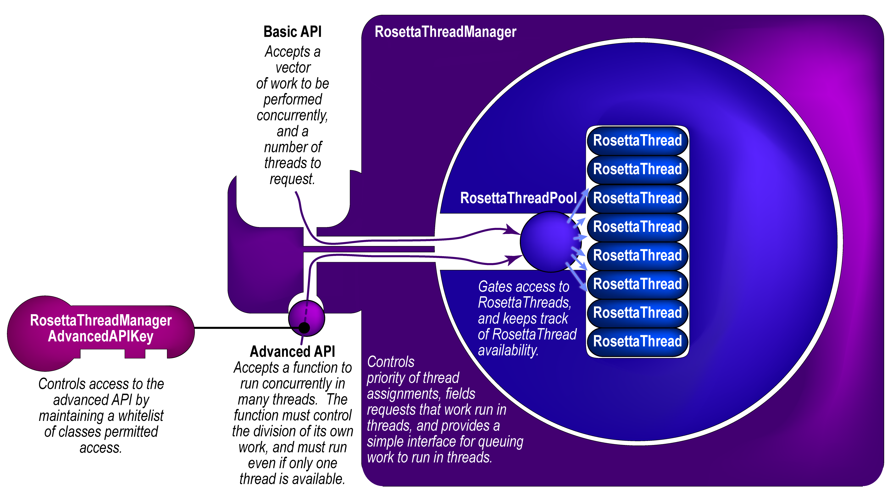
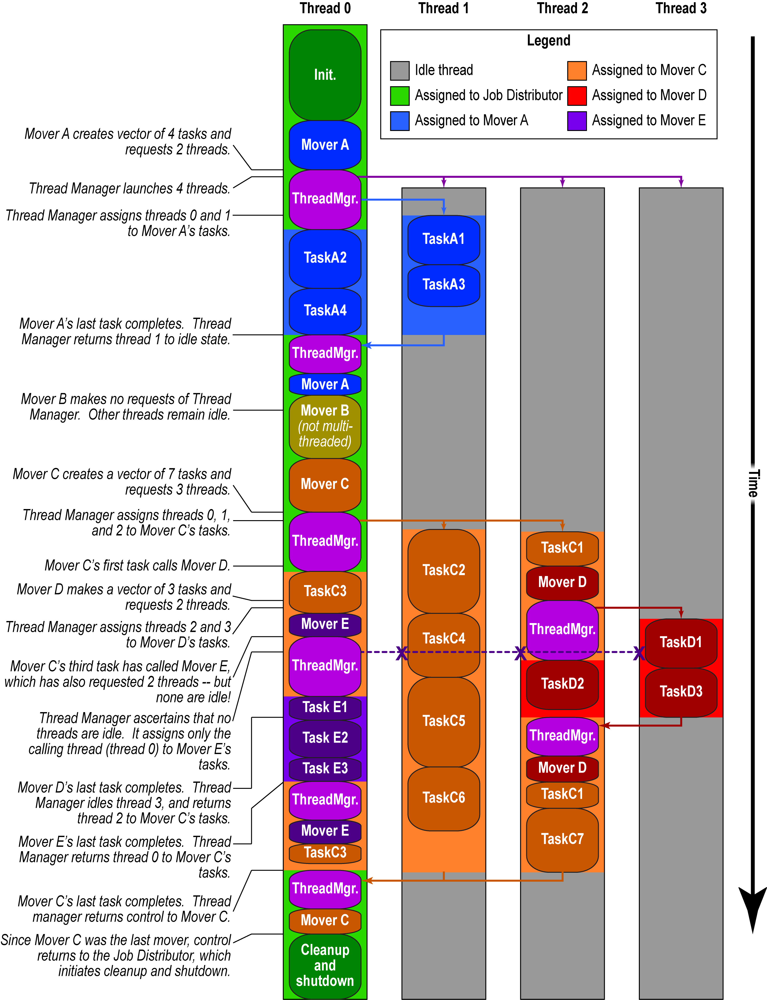

#The RosettaThreadManager

This page was created on 25 July 2019 by Vikram K. Mulligan, Flatiron Institute (vmulligan@flatironinstitute.org).

[[_TOC_]]

##Introduction

The RosettaThreadManager is a global singleton that manages a pool of threads, and allows modules at many different levels in the Rosetta hierarchy to assign work to threads, while avoidng deadlock, thread explosions, or other problems as described below.

##The problems that the RosettaThreadManager aims to address

Historically, Rosetta has been built around a single-threaded paradigm: a given instance of Rosetta would run on one CPU, and would execute a series of instructions in linear sequence, producing an output.  Multiple CPUs could only be harnessed by running entirely separate, parallel instances of Rosetta.  This creates several problems.

First, this exaggerates the memory footprint of Rosetta, for each instance on a compute node must load its own, independent copy of the Rosetta database and maintain it in memory.  Given that the base memory footprint for a single instance of Rosetta is about 1 GB, his means that, for example, a 64-core node must hold at least 64 GB of data in memory at all times to fully exploit CPU resources -- and this isn't counting whatever protocol-specific memory requirements there are.  On limited-memory systems, this can necessitate launching fewer Rosetta instances than there are CPU cores.

Second, this fails to harness computing resources in the most useful way, especially during the process of developing, debugging, and testing a new protocol (_e.g._ in the RosettaScripts scripting language).  Given 64 CPUs and, say, a design task that produces one output in an hour, one can produce 64 designs in an hour -- but if one stops the process after fifteen minutes, or half an hour, or forty-five minutes, one has 64 partially-completed jobs and no output at all.  It would be far more useful if more cores meant that a _single_ job could run N times _faster_ -- that is, that one could produce 1 design in just under a minute using all 64 cores.  Similarly, in a production environment, given 10,000 CPUs, one might not want 10,000 samples -- one might prefer 2,500 samples in a quarter of the time.  With independent processes, this is not possible.

If the slowest and most CPU-intensive parts of Rosetta protocols can be parallelized, perhaps we can achieve a many-fold increase in the speed with which individual jobs can be completed with many threads working in tandem on a _single_ job.  However, there are certain problems that must be addressed to make this possible.

### The problem of granularity of parallelism

Unlike MPI processes, which maintain their own copies of all memory objects and which are best suited to operating on large pieces of work costing seconds to minutes of CPU-time, threads operate best on small pieces of work, but ones which access similar regions of memory (to avoid cache misses that require repeated access to slower levels of memory).  While job-level parallelism is easiest to implement, more finely-grained parallelism requires that lower-level Rosetta modules be parallelized.  However, this creates the possibility of nested requests for multithreaded execution of code.

### The problem of nested requests for multithreading: thread explosions

Let's suppose that a high-level Rosetta module launches 16 threads to carry out a series of tasks, and that each task calls an intermediate-level Rosetta module which _also_ launches 16 threads to carry out a series of tasks.  There are now 272 threads running.  If each of the intermediate-level tasks calls a low-level module that launches an _additional_ 16 threads, this will result in 4,168 running threads, which could risk crashing even a powerful compute node.  Clearly, any multithreading scheme that allows intermediate- and low-level Rosetta modules to be parallelized must cap the total number of threads being launched.  As we will see, this is one of the primary functions of the RosettaThreadManager.

### The problem of avoiding deadlock

Certain capping schemes can create their own problems, in that they can result in threads that are waiting for other threads to complete their work before scheduling their own work.  In the worst case, these can create deadlock: thread A could be waiting for thread B, while thread B waits for thread A, resulting in both threads waiting permanently.  This too is avoided by the RosettaThreadManager.

##Structure of the RosettaThreadManager

The RosettaThreadManager contains a RosettaThreadPool object, which in turn contains a vector of RosettaThread objects.  The RosettaThreadPool is initialized (and launches its threads) the first time that anything asks the RosettaThreadManager to run code in threads.  The thread pool, and its associated threads, persist for the duration of the Rosetta session.  The container structure is shown in the figure below.

The RosettaThreadManager accepts requests that work run in threads (from any Rosetta module).  It receives information along with the request about where in the Rosetta code the request originated (_e.g._ from the job distributor, from a mover or filter, from the packer, _etc._).  At this point, there is the opportunity to make decisions about the extent to which requests will be honoured -- for example, rules like, "requests from core modules never get more than half the threads," or, "limit movers to two threads," could be imposed.  Currently, the RosettaThreadManager imposes a much simpler rule: the requesting module gets as many threads as have been requested, or the number available (whichever is less).  Since the requesting thread is always assigned to the task, at least one thread is always available.

### API

#### Basic work vector interface

If the basic RosettaThreadManager API is used (as is preferred), a module sends a request to the RosettaThreadManager for work to run in threads.  The requesting module passes to the RosettaThreadManager a vector of pieces of work, each of which is a function bundled with its arguments using `std::bind`.  These functions must be able to run in any order, concurrently or in sequence, and must all return nothing (`void`).  The requesting function also specifies a requested number of threads.  Optionally, it may pass an owning pointer to a ***TODO CONTINUE HERE***

On receiving a request, the RosettaThreadManager constructs a vector of mutexes equal in length to the work vector, then bundles both vectors with a work function to be executed in parallel.  This function is passed to the RosettaThreadPool which runs it in many threads.  The thread copies of the function draw work from the work vector while using the corresponding mutex vector to ensure that other thread copies of the function don't attempt to do the same blocks of work.  Since each thread claims the next piece of available work as it finished the work that it was doing, the function automatically load-balances itself.  When no more work is available, it blocks until all copies of itself have terminated, then returns control to the RosettaThreadManager, which returns control to the calling module.

##### General coding example
    #include <basic/thread_manager/RosettaThreadAssignmentInfo.hh>
    #include <basic/thread_manager/RosettaThreadManager.hh>
    
    using namespace basic::thread_manager;
    
    // The thread manager will populate this object with information about the number of threads actually assigned:
    // The originating level allows future logic prioritizing thread assignments based on layer of Rosetta  from which a thread request comes.
    RosettaThreadAssignmentInfo thread_assignments( RosettaThreadRequestOriginatingLevel::PROTOCOLS_GENERIC );
    utility::vector1< RosettaThreadFunction > work_vector; /*The tasks that we'll be doing in some random order, in parallel.*/
    utility::vector1< some_type > result_vector( num_tasks ); /*A place to store the output.  Could be a vector of Reals, for example.*/
    for( core::Size i(1); i<=num_tasks; ++i ) {
        core::pose::PoseOP pose_copy( utility::pointer::make_shared< core::pose::Pose >() );
        pose_copy->detached_copy( *master_pose );
        work_vector.push_back(
            std::bind(
                my_thread_function, /*void function*/
                pose_copy,
                master_scorefxn->clone(),
                /*A place to store output, with each thread writing to a different place in the vector -- CAN'T RESIZE VECTOR WHILE THIS IS HAPPENING.*/
                std::ref(result_vector[i]), 
                ... /*any other things that my_thread_function takes as inputs*/
            )
        );
    }
    // The work will run in threads now.  The number of threads actually used will be 1 <= actual number <= number requested.
    // The requesting thread is always used to do the work, plus up to number requested-1 additional threads, as available.
    RosettaThreadManager::get_instance()->do_work_vector_in_threads( work_vector, num_threads_to_request, thread_assignments );
    // After the work runs in threads, the thread_assignments object will have information about how many threads were actually used.
    // It may be fewer than the number requested.  You can use this for summary messages and whatnot.  You can also pass the
    // thread_assignments object to your thread function if you want this information  to be available within a thread.

##### Some notes
* Each thread must use a different instance of a ScoreFunction object and must operate on a different instance of a Pose.
* Poses must be cloned using `Pose::detached_copy()` before passing them to sub-threads. Regular `Pose::clone()` results in  a new object that shares data with the old, which can result in non-threadsafe behaviour.
* multithreaded Rosetta apps must be compiled with `extras=cxx11thread`, and must be run with `-multithreading:total_threads #`, where # is the number of threads to launch and maintain in the thread pool (often equal to the number of CPUs you have, though it can be less if you're launching multiple Rosetta instances per node). Default is 1 thread per Rosetta instance.

#### Advanced parallel function interface

****TODO****

##### RosettaThreadManagerAdvancedAPIKey class

##Example of work distribution over threads in a typical Rosetta session

**TODO**

##See also

* [[Multithreading]]
* [[PackRotamersMover]]
* [[FastRelaxMover]]
* [[FastDesignMover]]
