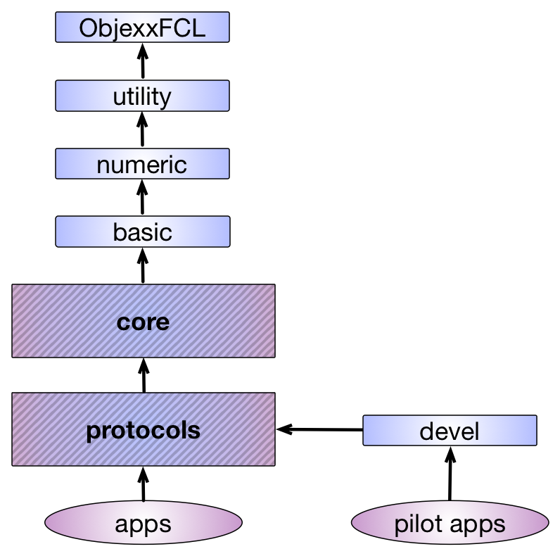
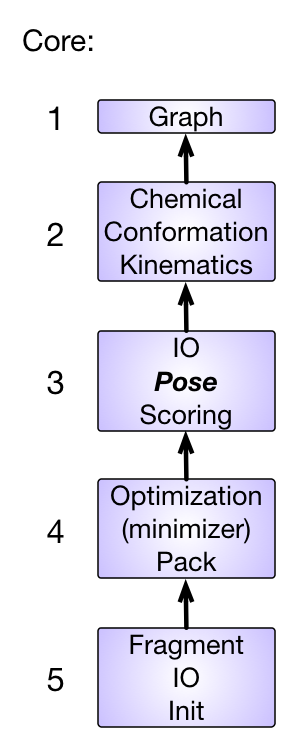

#An overview of the src directory

From a conceptual standpoint, the src directory contains all the C++ code specific to Rosetta. 
The directory structure within Rosetta delineates conceptual dependencies. 
A Rosetta developer should keep in mind the layered architecture depicted in the figure below. 
The arrows represent allowed dependency flows. 
Any code dependency on directories not accessible by following the arrows is not allowed. 
A strict vertical code dependency has been observed thus far in writing Rosetta code. 
This figure demonstrates the relationships between the libraries:

<<RawHtml(

<map name="RosettaLibraries">
	<area shape=rect coords="350,425,525,450" href=src-index-page#devel-library>
	<area shape=rect coords="10,385,295,465" href=src-index-page#protocols-library>
	<area shape=rect coords="10,285,295,365" href=src-index-page#core-library>
	<area shape=rect coords="55,220,227,250" href=src-index-page#basic-library>
	<area shape=rect coords="55,150,226,175" href=src-index-page#numeric-library>
	<area shape=rect coords="55,80,226,110" href=src-index-page#utility-library>
	<area shape=rect coords="55,10,225,50" href=src-index-page#objexxfcl-library>
</map>
)>>

##ObjexxFCL Library

The `ObjexxFCL` library provides the infrastructure needed to emulate Fortran by code that has been translated from Fortran 77 to C++. 
It is lightly used in Rosetta at present, having gradually disappeared as Rosetta became more object-oriented - the [[Rosetta to Rosetta++ to Rosetta3|Rosetta timeline]] transition. 
It remains to support some legacy code.

##Utility Library

[[Utility Library|namespace-utility]] 

The utility directory contains utility classes that are (at least in theory) not Rosetta-specific such as [[utility::vector1|vector1]] (a base 1 indexed of child class of std::vector with a few extra additions) and izstream (an infilestream which allows reading of zipped files). 
Broadly speaking, these classes are implemented in a project-agnostic manner (i.e. they need not be Rosetta-specific). 
Classes in this directory sometimes have mathematical class methods, but algorithms for complicated calculations are better placed in the numeric directory.

###Namespaces within utility
* [[utility|namespace-utility]]
* [[utility::io|namespace-utility-io]]
* [[utility::factory|namespace-utility-factory]] **NO LONGER EXISTS**
* [[utility::keys|namespace-utility-keys]]
* [[utility::options|namespace-utility-options]]

###Useful classes within utility
* [[Owning pointer|owning-pointers]]
* [[Access pointer|access-pointers]]
* Classes derived from std::vector
  * [[vector0]]
  * [[vector1]]
  * [[vectorL]]
* [[xyzVector]]
* [[xyzMatrix]]

##Numeric Library

[[Numeric Library|namespace-numeric]]

The numeric directory contains low-level functions that carry out mathematical operations. 
While some of these might be general mathematics (calculating a fast Fourier transform, for example, or performing principal component analysis on a dataset), others might be Rosetta-specific calculations or might be implemented in a Rosetta-specific manner.

##Basic Library <a name="basic" />

The basic directory contains organizational and housekeeping classes specific to the Rosetta project. 
Functions for accessing the Rosetta database typically reside here, for example, as does code for the Rosetta options system. 
Certain Rosetta-specific tools, such as the [[tracer]], can also be found in the basic library.

##Core Library <a name="core" />

<<RawHtml(

<map name="RosettaCores">
        <area shape=rect coords="98,627,274,726" href=src-index-page#core-library_core-5>
        <area shape=rect coords="98,479,274,578" href=src-index-page#core-library_core-4>
        <area shape=rect coords="98,330,274,431" href=src-index-page#core-library_core-3>
        <area shape=rect coords="98,182,274,281" href=src-index-page#core-library_core-2>
        <area shape=rect coords="98,99,274,132" href=src-index-page#core-library_core-1>
</map>
)>>

The core directory contains classes that manage most of the internal machinery of Rosetta. 
This includes topics such as chemical representations of models, conformational representations of models, low-level operations on conformations, and energetic evaluation ([[scoring|scoring-explained]]) of models.
The current structure was instituted at a weeklong event [[XRW1|Glossary#xrw1]].

###Core.1
The only important contents of this library level are the `graph` classes (graph in the computer science sense).

###Core.2
This library contains three important sections:

####Chemical
The chemical directory, which contains important classes like `ResidueType`, is how Rosetta understands the concept of what atoms are in a chemical entity and how the atoms are connected.

####Kinematics
The kinematics directory, which contains classes like `AtomTree`, `MoveMap`, and `FoldTree`, is how Rosetta propagates motion through a structure.  TODO linky internal coordinate kinematics
 
####Conformation
The `Conformation` class is what happens when you thread together `Residue` classes (based on `ResidueType`s) according to the kinematics dictated by the `AtomTree` - basically, a structure!

###Core.3

####Scoring
Fairly self explanatory: now that `Conformation` gets us a structure, how do we score it?
This contains all the `ScoreFunction` and all the common terms that go in it, and an `Energies` object to store the result of a scoring operation.

####Pose
`Pose`, one of the two most important classes in Rosetta, lives here.
[[Pose|RosettaEncyclopedia#pose]] is the marriage of a `Conformation` and an `Energies` object holding its scores.

###Core.4
Core.4 is concerned with optimization algorithms - ways to minimize the energy of the pose. 
`optimization` contains the "minimizer", which efficiently finds local energy minima.
`pack` contains the packer, which efficiently searches for sequence/rotamer minima for a given backbone.
Note the repeated use of efficiently: this code is tightly integrated with other `core` classes for speed!

###Core.5
This library contains several items, the most important of which is the `init` machinery that initializes each run of Rosetta (reads the options from command line, sets up the random number generator, etc.)

###Documentation by namespace (incomplete)

* [[core::chemical|namespace-core-chemical]]
* [[core::conformation|namespace-core-conformation]]
  * [[core::conformation::idealization|namespace-core-conformation-idealization]] **NO LONGER EXISTS**
* [[core::io::pdb|namespace-core-io-pdb]]
* [[core::scoring|namespace-core-scoring]]

###Readmes, Tutorials and Reference Documents for the Core Library

For a general overview of Rosetta concepts (including many concepts from core), please see the [[Rosetta overview]] page.

- chemical
    - [[Description of chemical|Rosetta-overview#chemical]]
- conformation
    - [[Description of conformation|Rosetta-overview#conformation]]
    - [[Symmetry]]
- pose
    - [[Brief description of pose|Rosetta-overview#pose]]
- kinematics
    - [[AtomTree overview and concepts|atomtree-overview]]
    - [[FoldTree overview and concepts|foldtree-overview]]
- optimization
    - [[Minimization overview and concepts|minimization-overview]]
- pack
    - [[How to use the PackerTask|packer-task]]
    - [[Resfile syntax and conventions|resfiles]]
    - [[How to write new resfile commands|resfile-reader]]
- scoring
    - [[Explanation of scoring in Rosetta|scoring-explained]]
    - [[Score types]]
      * [[Additional score types|score-types-additional]]
    - [[How to add a new scoring term|new-energy-method]]
    - [[Constraints file formats|constraint-file]]
 
##Protocols Library

[[/images/protocols_structure.png]]

The protocols directory contains higher level code which makes use of the core directory components to accomplish modeling tasks. 
The code in this directory should be in a state such that it is usable by a general audience.
Developers are expected to provide adequate documentation for all code placed in this directory. 
One of the main base classes to be aware of is the [[Mover]] class. 
This class is the interface class from which most Rosetta developers inherit when creating new modeling protocols. 
Most developers will interface with the Rosetta code at this level unless they need to extend the model representation capabilities of Rosetta.

Like the core directory, the protocols directory has been split into several library levels, with code in each level only allowed to depend on the levels below it. 

Protocols library organization is controlled by a series of protocols_X.#.src.settings files in `src/`, where X is a letter and # is a number. 
The numbers are the dependency level of each library, and the letters arrange similar-level sublibraries into a laterally equivalent group. 
In other words, libraries at the same number level have the same dependencies, but do not depend on each other: in fact they are forbidden from depending on each other.

When the protocols library was split at [[XRW2|Glossary#xrw2]], we were partly trying to institute order, and partly trying to fix a problem.
The protocols library (the largest in Rosetta) had grown to the point that linking was **very slow**, and took more memory in the linking step (>2GB, remember this was a while ago) than many developers' computers had. 
Ultimately, the former goal of organization proved elusive or impossible, but we met the second goal by splitting the previously monolithic protocols into *many* libraries.
As a consequence, to a great degree, the organization is only by fiat.
[[This page|XRW2 email archive]] documents decisions made at the time.
The description of the library levels is much deeper than here, but only partial.

If you are trying to determine "where your code goes", and there isn't a good answer below, the answer is "find something similar and put it in the same sublibrary", so long as the dependencies are otherwise legal (only pointing to lower numbers).
Lateral dependencies within a sublibrary are legal.

###Important Protocols library levels:

####Protocols.1
Lots of goodies live here, including [[the job distributor|JD2]], the base class [[Mover]] and some of the simple Movers, the base class [[Filter|filters-rosettascripts]] and simple Filters, the [[RosettaScripts]] machinery.

####Protocols.2
Your code should almost certainly not go here.

####Protocols.3
This level contains the vast majority of Movers and Filters that do simple things (as opposed to complex or highly specific Movers that live with their protocol directly).
It also contains `loops` machinery and `toolbox`, which holds lots of generic tools for detecting and manipulating classes or groups of residues (think interface-detection machinery, etc).

####Protocols.4-6
These levels each have many lettered sublibaries, organized by vague similarity and number of files, but it's kind of a mess. I'm sorry I can't help more.

####Protocols.7
This is not a library, this is just the protocols `init` layer.
It has a ton of Registrators and Creators for the [[Factory|http://en.wikipedia.org/wiki/Factory_method_pattern]] (wikipedia link)-managed Rosetta classes.

##Devel Library

The devel directory is a staging area for protocols in development, which is NOT included in Rosetta releases. 
Code in this area is not considered mature. 
Standards of documentation are lax. 
Documenting code after the fact is much more difficult, so it is HIGHLY recommended that a developer provide good documentation even for code that is fluctuating rapidly. 
It will make your life easier and more productive, and your colleagues will appreciate your thoroughness.

##Adding new code or subdirectories

Generally one will not want to add code in `src` directly.  
New subdirectories in one of the above existing directories can be added much more readily without damaging the overall structure of the library. First determine which level of the library the new concepts fit into. If one is unsure of where new code should be placed, consult experienced Rosetta developers. This can either be in one's lab or (even better) send a message out to the developer mailing list (One might find out that someone else has a complimentary idea with a starting point already available).

##See Also

* [[Rosetta directory structure|rosetta-library-structure]]: Descriptions of contents of the major subdirectories in the Rosetta `main` directory
* [[Glossary]]: Brief definitions of Rosetta terms
* [[RosettaEncyclopedia]]: Detailed descriptions of additional concepts in Rosetta.
* [[Rosetta overview]]: Overview of major concepts in Rosetta
* [[Development Documentation]]: The main development documentation page

<!---- SEO
code structure
code structure
code structure
code structure
library structure
library structure
library structure
library structure
---->