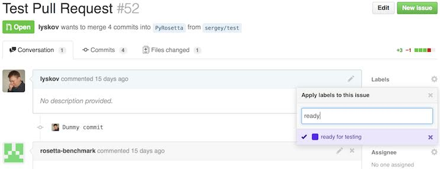
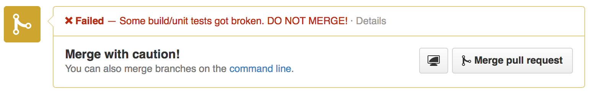
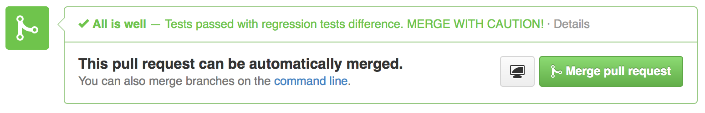

#Running Tests on the Test Server

Rosetta's [[testing server]] allows you to schedule custom tests, in addition to automatically testing your code after a merge to `master`. 
This is very useful for running tests with remote/RosettaCommons resources instead of your poor overburdened laptop.

Submitting arbitrary revision, branch or pull-request for testing
=================================================================

You can visit http://benchmark.graylab.jhu.edu/submit (or click the link 'Submit' at Benchmark web site) and submit your commits for testing. 
You will need a git commit sha1, the name of your branch, or a [[pull request|pull requests]] id to identify what to test.
After you click the arrow button, the testing server will query GitHub for commit info.
If the commit was found, you will be presented with commit information (for confirmation) and a list of tests that could be scheduled for this revision. 
If you used a branch name, the testing server will use the current head of the specified branch.
For a pull request, it will not use a single commit, but merge between the base and target branch and display the git sha1 that would be used for merges:

After you select tests that you want to run, you can click `Run tests for this commits` to schedule selected tests. 
When choosing tests please avoid running ones that you don't really need. 
Be careful when using 'select all' button since some tests could take considerable time to run. 
When debugging a particular test it is probably a good idea to run just this particular test instead of a whole set which will reduce server load and turnaround time. 
For your convenience there is green button 'select standard tests' that will run the same tests run on merges to master.

After scheduling tests, the testing server will take you to a revision page on which results will appear. 
Additionally it will send you a commit acknowledgment email containing a link to the result page.
When testing complete is complete, another email will notify you of the results. 

Regression tests such as [[integration|integration tests]] or [[score tests]] scheduled this way will have their results compared to latest successful run of the same test from master branch. 
This effectively allows you to get an idea of what tests will change when you merge this commit to the master branch.

Automatic testing of Pull Requests 
==================================
When your [[pull request]] (for any branch, not necessarily master) is almost ready to merge, it is a good idea to test it before merging to avoid breaking any tests. 
The testing server is now capable of automatically tracking and testing each push to the branch associated with a currently open pull request. 
All you need to do is to mark this pull request with a 'ready for testing' label. 
To do this open your pull request page on GitHub and click on 'labels' in upper right part of the page and select the 'ready for testing' label:

After this is done the testing server will automatically schedule tests for the current pull request merge as well as all consequent merges. 
If you want to instruct the testing server to stop tracking this particular pull request simply remove the 'ready for testing' label.

After the testing server's scheduled tests run, the merge button on your pull request should change to the 'pending state' and the 'Details' link will take you to this revision's page on benchmark web site:

As soon as the pull request tests are finished, the testing server will post results back to GitHub along with a short message. 
And each tested commit in the pull request will have either green check mark or red cross depending on test results. 
You can also hover over this icon with the cursor to display the message associated with this merge or click the icon to view the revision page with test results on Benchmark website:

Also, depending on tests' results, the merge button on your pull request will now turn red if there are any broken tests:

Or merge button will become green if all is good:

Canceling scheduled tests
=========================
If you happened to schedule the wrong tests or pushed a few revisions in a row to your pull request branch you might want to cancel scheduled tests that are no longer relevant (for example because a newer revision of the same branch is already scheduled for testing as well). 
You can cancel all scheduled tests for a given revision (except for `master`) on revision's web page or you can cancel individual tests on the test's web page. 
To do so press the red 'cancel all queued test' button. 
Similarly you can re-queue all or individual tests later with white 'queue canceled test' button. 

Testing of custom branches
==========================
It is possible to instruct the testing server to track any custom branch from our GitHub main repository and run a custom set of tests for each push like we do for `master` and some other branches. 
This will allow you to monitor code differences, states of build tests and regression tests changes for each push. 
If you happen to work on a project for which this seems appropriate—for example a project involving multiple developers working on the same protocol or just want to track your lab branch—let [[Sergey Lyskov|Rosetta-People]] know and he will add your branch to tracking list.

##See Also

* [[Testing server]]: Information on the testing server
* [[Integration tests]]: General information on Rosetta's integration tests
* [[Build Documentation]]: Find instructions for building Rosetta mpi executables here
* [[Testing server]]: Server that can be used to run Rosetta integration tests automatically
  * [[Running Tests on the Test Server]]: Instructions for using the testing server
* [[Testing home page|rosetta-tests]]
* [[Development documentation home page|Development-Documentation]]
* [[RosettaEncyclopedia]]
* [[Glossary]]