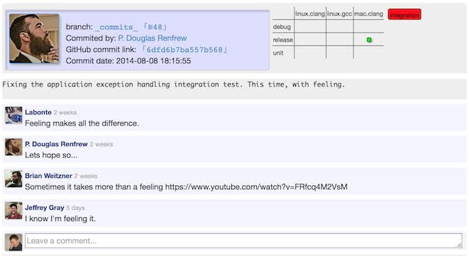

#Testing Server

TODO: This page is a work in progress cobbled together from private emails and should be re-written in a more presentable form.

The testing server can be found at [[http://benchmark.graylab.jhu.edu/]]. 
Its purposes are twain:
-	to automatically test every revision of master to ensure that nothing breaks without everyone noticing, and
-	to automatically test commits to other people's branches (by merging master into them), to reduce the workload of development and keep a record of the development status of every branch.

Ultimately, the test server is intended to limit the frequency of breaking master.
See [[Running-Tests-on-the-Test-Server]] for full detail on how to use the testing server.

Below are sections which should be completed/written.

### Orientation (How to Interpret the Testing Server)
The testing server provides extensive data: one can view each input and output file involved both in the revision of master that serves as the basis of comparison for any given test and for the commit being tested.
If your commit causes a failed test, first check to see if the last commit (or the last commit to master) broke the same test. If so, you may not be responsible, though you should be careful. Otherwise, the broken test is YOUR FAULT. This isn't an incriminating thing; blame does not have to be emotionally charged! The fact that your code has changed something that is being covered by a test compliments our test coverage and the ambition of the code you wrote.

It does nonetheless imply something that you're responsible for. You must either fix the test or demonstrate that its change is a good, designed, desired thing.
This is not as obvious in the workflow of Rosetta development as perhaps it ought to be: you are responsible not just for your pet protocol but for the consequences you may not anticipate!
This is what makes development complicated.

### What to Do in Case of a Failed Test
If a test does not run, use GDB or LLDB (depending on your compiler) to step through the execution of that test to locate the error.
If a test does run successfully, but there is a deviation from the prior results. you _need_ to track down exactly where the deviation begins.
For short trajectory integration tests and unit tests, this is in principle very easy: there is a number that is not what it should be, and there is a very small group of reasons why it might have changed.
The simplest approach is to just flood everything involved with tracer or std::cout statements: if you can dump every variable to standard output, you can have an impression of what's going wrong.
Of course, it's possible to accomplish all of this via simple debugging, but sometimes tracer statements can feel more flexible, faster, or more easily understood.

There are some _limited_ cases where test deviations are okay, even if you cannot explain them perfectly.
If you experience test deviations in very long trajectories (e.g. relax) but not short trajectories, then it MAY be that some difference in the order of multiplication of two floating point numbers is eventually having an effect. But you have to make that clear: you have to identify the very moment of deviation.

######Comments on Revisions
It is now possible to add comments on any acknowledged revision. 
To add a comment, simply login with your github account and type your comment text. 
While posting you can also select 'notify the list' check box if you want notification of this comment to be sent not only to the author of revision and people who have already commented on this particular revision but to the mailing list associated with this branch (rosetta-log list in case of master branch). 
You can also delete your existing comments (you need to be logged in) by pressing the X button on top-right of your comment. 

Comments are an excellent way to pseudo-amend bad commit messages!
Our GitHub repositories only accumulate history and do not allow rewriting of history, so if you pushed some revision with a wrong/empty/merge commit message there is no way to undo this action. 
Instead, use the comment feature to supply additional information for future records, or just communicate with the other developers:

##See Also

* [[Integration tests]]: General information on Rosetta's integration tests
 * [[Running Tests on the Test Server]]: Instructions for using the testing server
* [[Testing home page|rosetta-tests]]
* [[Development documentation home page|Development-Documentation]]
* [[RosettaEncyclopedia]]
* [[Glossary]]
