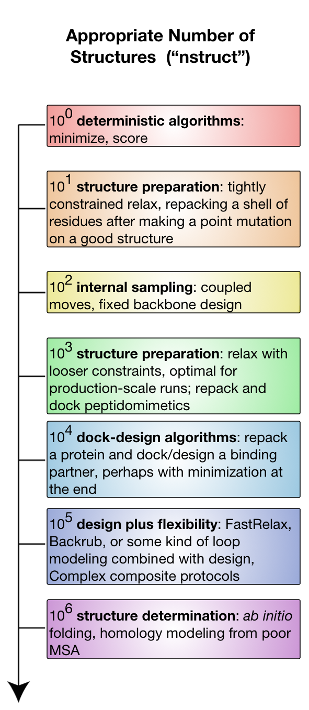

# Rosetta on Different Scales

Rosetta is a very hungry program in terms of computer time.
This is partly because protein modeling is about the [[hardest problem|http://xkcd.com/1430/]] we know.
It is partly because Rosetta is largely written by professional biophysicists who are less experienced at software engineering and totally inexperienced with [[optimizing|https://en.wikipedia.org/wiki/Program_optimization]] algorithms for speed.
(That said, the [[inner loops|https://en.wikipedia.org/wiki/Inner_loop]] really are quite optimized by people who knew what they were doing!)

This page talks about Rosetta in terms of both `nstruct`—the Rosetta flag to control the **n**umber of **struct**ures generated—and the computer time needed to generate those structures.
Ideally, one always runs enough models to sample enough of the search space to answer their modeling question.
In the real world, experimenters are constrained by computer time.
Additionally, the question of how many nstruct are necessary is heuristic and specific to the problem.
This document attempts to address in a harder sense how many nstruct models one wants for different types of experiments (and why!), and in a softer sense approximately how much computer time we are talking about.
The [[results analysis|Analyzing-Results]] page also addresses the issue.

Broadly, the number of models one needs to address a problem is related to the size of the search space, which is related to the number and type of degrees of freedom.
The major classes of degrees of freedom, in order of complexity, are:
* sidechain rotamer freedom (small numbers of atoms move)
* sidechain design freedom (functionally a superset of rotameric freedom: some rotamers just have different atoms)
* rigid body freedom (docking problems)
* backbone freedom (moving the backbone atoms relative to one another)
Backbone freedom is most expensive because it is a very rugged search space (tightly packed atoms must be moved carefully) and, as a consequence of [[internal coordinate folding|internal coordinates]], large motions can produce lever arm effects that disturb large parts of models.

The diagram sketches out different experiments available on a logarithmic nstruct scale.
Assume computer time is positively correlated with nstruct.

<!--- NOTE the image map is upside-down for whatever reason --->
<<RawHtml(

<map name="GraffleExport">
	<area shape=rect coords="89,1100,574,1200" href="Rosetta-on-different-scales#106-and-up">
	<area shape=rect coords="89,930,574,1080" href="Rosetta-on-different-scales#105">
	<area shape=rect coords="89,760,574,905" href="Rosetta-on-different-scales#104">
	<area shape=rect coords="89,620,574,750" href="Rosetta-on-different-scales#103">
	<area shape=rect coords="89,500,574,570" href="Rosetta-on-different-scales#102">
	<area shape=rect coords="89,310,574,450" href="Rosetta-on-different-scales#101">
	<area shape=rect coords="89,190,574,270" href="Rosetta-on-different-scales#100">
</map>
)>>

##100
At this logarithmic scale, one single model, we can use Rosetta protocols that are deterministic: protocols that are not employing a Monte Carlo search.
The notable entries here are [[scoring|scoring-explained]] and [[minimization|minimization-overview]].
Running the minimizer directly on an input structure is relatively rare (it will immediately get trapped in a local minimum) but plausible.
Scoring a structure is a very common event.
This scale will generally be fast and can run on a laptop.

##101
At this scale, we can consider protocols that are intended to have a very small search space and those that can be completely sampled.
10 to 100 models are reasonable for most [[structure preparation|preparing-structures]] efforts, because these efforts are meant to be tightly constrained to the starting model, only fixing serious errors.
This range is also reasonable for minor [[repacking|fixbb]] experiments.
Repacking is feasible because it samples *very extensively* inside the protocol, so relatively few nstruct are needed.
This scale will generally be fast and can run on a laptop.

##102
At this scale, we can consider smaller experiments sampling mostly non-backbone internal degrees of freedom: the sidechains.
Sampling only the sidechains leads to a relatively small and less frustrated search space, partly because very few atoms move at a time and there are never large concerted (or unconcerted) movements of many atoms.
The archetypical application here is [[fixed backbone design|fixbb]].
Again, fixbb can run on small scales because the guts of the packing algorithm are very optimized and run many cycles internally.
Fixbb generally fast and runs on a laptop, although large design jobs may require more memory than less powerful computers will have.

Coupled moves, available as an executable (coupled_moves) or a RosettaScripts mover (CoupledMover), incorporates a limited amount of coupled (hence the name) backbone and sidechain flexibility via the BackrubMover; it also has facilities for ligand manipulation.
Importantly, it uses the BoltzmannRotamerMover to select rotamers for each position, rather than the packer, which improves speed and can lead to greater sequence diversity, making it a great choice for diversifying one's starting structure.
Because it considers and discards many solutions per eventually produced decoy, relatively few decoys are needed, though the time needed to produce each one is considerably longer than all but the largest fixbb jobs.
Again, note the trend toward repeated sampling *inside* a trajectory.

##103
At this scale, we begin to consider experiments that introduce non-sidechain degrees of freedom.
Introducing backbone flexibility is very expensive in terms of search space, so we next introduce rigid-body freedoms instead, allowing for small docking problems.  
For example, it is very common to perform so-called dock-design algorithms, where one runs repeated cycles of rigid body refinement docking alternated with repacking and design.
These algorithms are particularly valuable for optimizing protein-peptide and protein-peptidomimetic interfaces.  
Peptides have relatively few backbone dihedrals, so small perturbations do not inflate the sampling problem too much.
Even better is the use-case for peptidomimetics, which are molecules closely derived from or related to peptides with improved pharmacological and typically conformational properties.
A peptidomimetic molecule might have only one or two stable conformations per residue subunit, meaning that even full sampling of peptidomimetic conformational space is compatible with rigid body docking, packing, and design.
This scale is also useful for moderately constrained [[relax]] runs used as part of [[structure preparation|preparing-structures]] or at the tail end of [[ab initio structure prediction|abinitio-relax]].
In this regime, you will generally want something more powerful than your desktop computer: either a many-core lab workhorse or a small run on a lab-scale cluster.

##104
At this scale, we are able to start seriously sampling larger scale docking problems while repacking and even redesigning.
This is also reasonable for smallish backbone sampling protocols, like [[loop modeling|loopmodel]] of a single, moderate-length loop.
This is also the bare-minimum of sampling required for local [[docking|docking-protocol]], where the initial protein configuration is close to the biological configuration.
These sorts of problems you will need serious hardware to run: either long periods of time (overnight to days) on lab workhorses, small runs on lab-scale clusters (hundreds of CPUs), or tiny runs on large supercomputers.

##105
At this scale, we gain the ability to start sampling backbone flexibility, while still considering sidechain and rigid-body degrees of freedom.
We are able to sample enough to start thinking about [[backrub]] or [[FastRelax|relax]] ensembles.
This regime is also considered reasonable sampling for most flexible-backbone interface design protocols.
Fixed sequence protocols are faster than design protocols in this space.
Global [[docking|docking-protocol]], where large swathes of rigid-body space must be explored becomes plausible.
The computing resources needed scale from heavy use of a 500-CPU lab cluster to moderately large runs on large supercomputers (hundreds of processors for many days).

##106 and up
At this scale, we can attempt to address any problem you can imagine.
_ab initio_ [[structure prediction|abinitio-relax]] involves starting with no model at all, only a sequence, so its possible backbone conformational search space must be very well sampled.
This is the ideal scale for [[docking|docking-protocol]].
Fully atomic protocols at this scale are *very* expensive computationally, requiring serious use of national-scale supercomputing resources.
Structure prediction is often less than fully atomic - most stages use [[centroid|centroid-vs-fullatom]]s instead.
This is much faster, so some experiments in this regime can be surprisingly fast, needing much less than an order of magnitude more time (or even less time in an absolute sense) than earlier tiers.

##See Also

* [[Challenges in Macromolecular Modeling]]: Discusses the problems of sampling and scoring in protein modeling.
* [[Analyzing Results]]: Tips for analyzing results generated using Rosetta
* [[Comparing structures]]: Essay on comparing structures
* [[I want to do x]]: Guide on performing different forms of sampling in Rosetta
* [[Resources for learning biophysics and computational modeling]]
* [[Getting Started]]: A page for people new to Rosetta
* [[Solving a Biological Problem]]: Guide to approaching biological problems using Rosetta