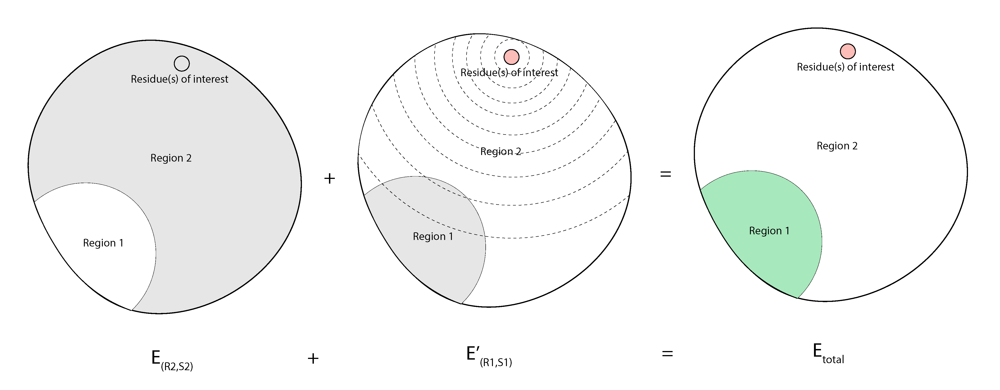

# GAMESS Electric Fields

## Summary 
In MultiScoreFunction one can score the different regions of a molecular system with different scorefunctions. On top of that, one can select one or more resuides, outside the region, to be taken into account as an external force field. A mean uniform vector from partial charges on those residues will affect each grid point on the selcected region. Then the total energy will be a sum of energies for each region. Note that the energies for each region are not seperately reported, but energy terms are seperated. Therefore, if you use QM forcefield only for one region, the `gamess_qm_energy` term will refer to that specific region.

Figure 1. shows an schematic of how this works.

<figure align=center>

</figure>


[comment]: <> (The grid size by default is set to 1A and 0A padding. Figure 2. shows a more detailed representation on it.)


You can use this feature in Rosetta scripts, commandline, pyRosetta, or c++ codes. 

## Rosetta scripts

### Selecting regions

First, we select `region1` for QM caclulations, and `region2` for electrostatic effect of `region1`. In this case, residues 25 and 27 are selected, but in practice, thise selection will result in residue 26 also being selected. When a residue is selected, the terminal atoms are not satisfied, and this will end in QM putting free electrons on that point, which is not desired. To avoid this, Rosetta adds cappings to selected residues. On N-terminal, it adds a -C(O)(CH3) group, and on C-terminal it adds a -N(H)(CH3) group. As a result, when two residues with one distance are selected, after capping, there will be a clash between two CH3 groups. In this case, to resolve the clash, Rosetta selects the residue in between as well. 

```
<RESIDUE_SELECTORS>
    <Index name="region1" resnums="40,84,176" />
    <Index name="region2" resnums="25,27,40,84,176" />
</RESIDUE_SELECTORS>
```
### Setting score functions

You define score functions that will be applied later to each region individually.

```
<SCOREFXNS>

    <ScoreFunction name="r15" weights="ref2015_cst.wts" />

    <ScoreFunction name="gamess_highquality" weights="empty.wts" >
        <Reweight scoretype="gamess_qm_energy" weight="1.0" />
        <Set 
            gamess_basis_set="HF-3C" 
            gamess_electron_correlation_treatment="HF"
            gamess_max_scf_iterations="100" 
            gamess_threads="2"
            gamess_use_scf_damping="true"
        />
    </ScoreFunction>

    <ScoreFunction name="gamess_lowquality" weights="empty.wts" >
            <Reweight scoretype="gamess_qm_energy" weight="1.0" />
            <Set 
                gamess_basis_set="HF-3C" 
                gamess_electron_correlation_treatment="HF"
                gamess_max_scf_iterations="10" 
                gamess_threads="2"
                gamess_fmo_calculation="true" 
                gamess_hybrid_molecular_orbital="HF-3c"
                gamess_use_scf_damping="true" 
                gamess_max_fmo_monomer_scf_iterations="10"
            />
    </ScoreFunction>
```

Then, we add a `MultiScoreFunction` in which `SimpleElectricFieldCombinationRule` is defined. In this case, no residues are selected specifically to affect the selected region, therefore, in each step, everything outside the region will create a effective electric field for that region. 

```
    <MultiScoreFunction name="msfxn_grid" dump_pdbs="true" >
        <SimpleElectricFieldCombinationRule dielectric_constant="3.23" mean_field_method="grid"  />
        <Region scorefxn="gamess_highquality" residue_selector="region1" >
                <CappedBondResolutionRule />
        </Region>
        <Region scorefxn="gamess_lowquality" residue_selector="region2" >
                <CappedBondResolutionRule />
        </Region>
        <Region scorefxn="r15" >
                <SimpleBondResolutionRule />
        </Region>
    </MultiScoreFunction>

    <MultiScoreFunction name="msfxn_atoms" dump_pdbs="true" >
        <SimpleElectricFieldCombinationRule dielectric_constant="3.23" mean_field_method="atoms"  />
        <Region scorefxn="gamess_highquality" residue_selector="region1" >
                <CappedBondResolutionRule />
        </Region>
        <Region scorefxn="gamess_lowquality" residue_selector="region2" >
                <CappedBondResolutionRule />
        </Region>
        <Region scorefxn="r15" >
                <SimpleBondResolutionRule />
        </Region>
    </MultiScoreFunction>

</SCOREFXNS>
```

And you retrieve the energy with `TotalEnergyMetric`, and adding it to `PROTOCOLS`.

```
<SIMPLE_METRICS>
    <TotalEnergyMetric name="metric_atoms" scorefxn="msfxn_atoms" />
    <TotalEnergyMetric name="metric_grid" scorefxn="msfxn_grid" />
</SIMPLE_METRICS>
<PROTOCOLS>
    <Add metrics="metric_atoms,metric_grid" />
</PROTOCOLS>
<OUTPUT scorefxn="r15" />
```