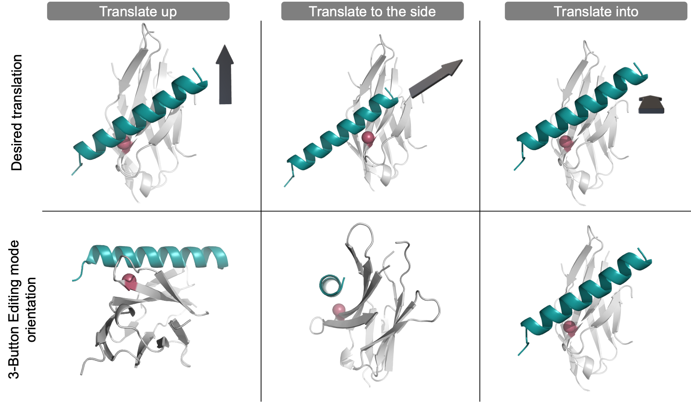

# Grid Dock Mover

[[_TOC_]]

# Description


The Grid Dock mover utilizes the basic six degrees of freedom (DoF) to dock a protein in 3D space: translating and rotating one domain around three user-defined axes, commonly known as the x-axis, y-axis, and z-axis. The user defines both the coordinate frame and the sample space allowing for a user-friendly and highly customizable docking system. When complete, this mover generates output pdb files of each newly docked pose.

This mover was written by Alice Peng and Odessa Goudy of Brian Kuhlman’s laboratory at the University of North Carolina - Chapel Hill. The authors would like to give a special thank you to Steven Lewis and Andrew Leaver-Fay for all their help and insight.

This documentation was last updated April 2022. Please send any questions to Brian Kuhlman at [bkuhlman@email.unc.edu](mailto:bkuhlman@email.unc.edu).


# Definition


```xml
<SixDoFGridDockMover 
name = "(&string;)"
dof_residue_selector_1 = "(&string residue_selector;)"
dof_residue_selector_2a = "(&string residue_selector;)"
dof_residue_selector_2b = "(&string residue_selector;)"
values_trans_axis_1 = "(&real_cslist;)"
values_trans_axis_2 = "(&real_cslist;)"
values_trans_axis_3 = "(&real_cslist;)"
values_rot_axis_1 = "(&real_cslist;)"
values_rot_axis_2 = "(&real_cslist;)"
values_rot_axis_3 = "(&real_cslist;)" 
range_trans_axis_1 = "(&real_cslist;)"
range_trans_axis_2 = "(&real_cslist;)"
range_trans_axis_3 = "(&real_cslist;)"
range_rot_axis_1 = "(&real_cslist;)"
range_rot_axis_2 = "(&real_cslist;)"
range_rot_axis_3 = "(&real_cslist;)" 
max_samples = "(10000 &non_negative_integer;)"
degree_check = "(true &bool;)" />
```


* **dof_residue_selector_1:** Residue selector that, in combination with two other residues, specifies the start coordinates of the grid.
* **dof_residue_selector_2a:** Residue selector that, in combination with two other residues, specifies the start coordinates of the grid. Of note, the user selects 3 residues that form a 90° angle with res_2a as the vertex.
* **dof_residue_selector_2b:** Residue selector that, in combination with two other residues, specifies the start coordinates of the grid.
* **values_trans_axis_1**: comma separated list of translation values across Axis 1, in Angstroms. Cannot be used with range_trans_axis_1.
* **values_trans_axis_2**: comma separated list of translation values across Axis 2, in Angstroms. Cannot be used with range_trans_axis_2.
* **values_trans_axis_3**: comma separated list of translation values across Axis 3, in Angstroms. Cannot be used with range_trans_axis_3.
* **values_rot_axis_1:** comma separated list of rotation values around Axis 1, in degrees. Cannot be used with range_rot_axis_1.
* **values_rot_axis_2:** comma separated list of rotation values around Axis 2, in degrees. Cannot be used with range_rot_axis_2
* **values_rot_axis_3:** comma separated list of rotation values around Axis 3, in degrees. Cannot be used with range_rot_axis_3.
* **range_trans_axis_1**: comma separated list of minimum, maximum, and step size translation across Axis 1, in Angstroms. Cannot be used with values_trans_axis_1.
* **range_trans_axis_2**: comma separated list of minimum, maximum, and step size translation across Axis 2, in Angstroms. Cannot be used with values_trans_axis_2.
* **range_trans_axis_3**: comma separated list of minimum, maximum, and step size translation across Axis 3, in Angstroms. Cannot be used with values_trans_axis_3.
* **range_rot_axis_1:** comma separated list of minimum, maximum, and step size rotation around Axis 1, in degrees. Cannot be used with values_rot_axis_1.
* **range_rot_axis_2:** comma separated list of minimum, maximum, and step size rotation around Axis 2, in degrees. Cannot be used with values_rot_axis_2.
* **range_rot_axis_3:** comma separated list of minimum, maximum, and step size rotation around Axis 3, in degrees. Cannot be used with values_rot_axis_3.
* **max_samples:** the maximum number of anticipated output structures, with the default set to 10,000. To the user’s benefit, this option is provided to help prevent unintentionally massive runs.
* **degree_check:** true (default) indicates the mover will exit when the residue selectors are not within the ideal range of 60-120° (with res_2a at the vertex). To override this check, set to false.


# Required parameters


## Residue selectors

The user must select 3 residues that ideally form a 90° angle with res_2a as the vertex, based on the starting input pose. The carbon alpha atom coordinates of 3 residues create 3 orthogonal vectors. These vectors then define the axes of the docking coordinate system. 


**User-selected residues generate an intuitive orthogonal coordinate system.** In this model, the dark grey helix will be docked within the green region of the light grey protein. The three colored spheres (blue, yellow, raspberry) represent the user-selected residues. _Left_: The user selects 3 residues. One residue is on the static domain within the green docking space while the other two residues are on the mobile helical domain. _Right_: Given the CA atoms of each residue, an orthogonal coordinate system is generated. Note that Axis 1 is orthogonal to both Axis 2 and Axis 3 (which are created first based on the user-selected residue coordinates).

💡 User Pro Tip:  Set **res_1** as a residue on the **static** domain at the **center** of the docking interface. 

💡 User Pro Tip: Set **res_2a** as a **center** residue on the **mobile** domain that is directly across from res_1.

💡 User Pro Tip: Set **res_2b** as a residue on the **mobile** domain taking care to ensure that the carbon-alpha is pointing **in the same direction** as that of res_2a.

Although any 3 residue selectors can be chosen, following the above recommendations gives the user an intuition of how the domain will move even before the mover is implemented. The closer to a 90° angle (with res_2a at the vertex), the better the selected residues align with the resulting coordinate system.


**User-selected residues ideally form a 90° angle.** In this model system, the dark grey helix will be docked within the green region of the light grey protein. The three colored spheres (blue, yellow, raspberry) represent the location of the three user-selected residues within the proteins (top) and the subsequent coordinate system (bottom). _Left_: The user selects 3 residues that form a 90° angle with res_2a (yellow) as the vertex. _Center_: The 3 residues form a 110° angle, which is acceptable but not ideal as Axis 2 does not align well with res_2b. _Right_: The 3 residues form a 50° angle, which is non-ideal and will cause the mover to exit unless the degree_check option is turned off by the user. Note that although an orthogonal coordinate system will be generated in every case, the user will have a more accurate intuition of the coordinate system, specifically Axis 2, if the selected residues form a 90° angle.


## Search space dimensions for all six degrees of freedom

This mover utilizes the basic six DoFs: translation and rotation around three axes. To run the mover, the user must provide **either** a user-specified range **or** a list of values for **each** DoF. When using the **range option**, the user provides a comma-separated list of the minimum, maximum, and step-size (in that order). In example, if the user provides ```2, 8, 1```, the mover will return the following search space: [2, 3, 4, 5, 6, 7, 8].

Alternatively, when using the **value option**, the user provides a comma-separated list of specific values for search space. If the user provides ```1, 2, 3```, the mover will only sample those specific values for that specific DoF. 

💡 User Pro Tip: The user can mix and match the range or value options for any of the six DoFs. However, the user must provide only one option for each DoF.

💡 User Pro Tip: To turn off a specific DoF, setting the value option to zero is recommended.

Below is an example set up for the 6 DoFs, which generates 504 poses (or, the product of each dimension for every DoF).


**Custom user-provided search inputs for all six degrees of freedom.** In this example setup, the user mixed and matched range and value options for the six DoFs. The converted sample search space is listed beneath the input. To illustrate how the mover iterates through the sample space and assigns job indices, the resulting DoF values for first and last job are listed (grey inset).  


# Optional parameters


## Max samples check

max_samples: Maximum number of expected output structures. (The default value is set to 10,000.) Set max_samples to a value greater than or equal to the number of output structures expected. The mover will exit if the search space is larger than the maximum. (In example, if the user provides a combination of range and value options that yield a docking search space greater than 10,000, then the mover will exit.) To the user’s benefit, this option is provided to help prevent unintentionally massive search spaces. 

Note, Multistage Rosetta Scripts requires a similar but different parameter known as num_runs_per_input_struct that must be set to the _exact_ value of the expected sample size (the product of each dimension for all six DoFs).


## Disable degree check

degree_check: Boolean. If set to “true” (the default), the mover will automatically end the job if the three selected residues form an angle outside of the ideal range of 60-120° with res_2a at the vertex. The user can set the degree check to “false” to turn off the degree check causing the mover to continue even when the angle is outside of the ideal range. It is only recommended to disable this option if the user has limited residues to choose from, as could be the case if docking a small peptide.

If the user disables the degree check, it is strongly recommended to first check how the mobile domain moves in the coordinate system.


# Advanced description


## Important information

A principal advantage of grid docking is finding narrow energy wells that traditional Monte Carlo centroid-mode docking approaches could miss due to a biased centroid-mode score function. Furthermore, this mover allows the user to explicitly control the [roll](https://upload.wikimedia.org/wikipedia/commons/thumb/7/7d/Roll_pitch_yaw_mnemonic.svg/440px-Roll_pitch_yaw_mnemonic.svg.png) of the mobile domain - a rotation that is anecdotally observed to be under sampled in other docking protocols. However, disadvantages of this system include a predetermined sample space and the large number of output structures.

To address this limitation and to decrease the number of output structures, this mover was designed to work within the [Multistage Rosetta Scripts](https://www.rosettacommons.org/docs/latest/scripting_documentation/RosettaScripts/multistage/MultistageRosettaScripts) platform so the output can be easily filtered and directed to a subsequent design step.

At the start of the Six Degree of Freedom Grid Dock protocol, this mover initially extracts the carbon alpha atom coordinates of 3 residues to create a user-defined coordinate system. Using this coordinate system, one mobile domain (the second domain in the pdb file, generally chain B) is docked in 3D space. Translations are in angstroms, rotations in degrees. The rotational DoFs are applied first to reduce the lever-arm effect. 


**The order in which the six docking parameters are applied**. In this model system, the starting helix (dark grey) is first rotated around three axes (steps 1-3) and then translated (steps 4-6). In each successive panel, the N and N-1 poses are shown with arrows to show the movement; The N pose matches the docking parameter label color. The output pose is generated only after all six parameters have been applied. For clarity, the coordinate system is originally generated based on the starting helix (dark grey); each successive rotation and translation is iteratively applied to the input pose based on the original coordinate system. 

For each output pose, the sampled DoF values are reported within the output scorefile with the following column names: axis1_rot, axis2_rot, axis3_rot, axis1_trans, axis2_trans, axis3_trans. Following docking, the score is reported to the scorefile as defaultscorename. Including the mover [FilterReportAsPoseExtraScoresMover](https://new.rosettacommons.org/docs/latest/scripting_documentation/RosettaScripts/Movers/movers_pages/FilterReportAsPoseExtraScoresMover) allows the user to report the filter’s value at the time it is called for later output to the scorefile.


## Example XML files

To supplement this documentation, example Multistage Rosetta Scripts are provided at ______.

The main directory contains four subdirectories which correspond with the documentation: [visualizing the coordinate system](#2-visualize-the-coordinate-system), [a coarse-grain grid dock](#3-set-a-coarse-grain-grid-dock-search-space), [following grid dock with local dock](#4-expand-the-best-grid-docked-poses-with-local-docking), and [combining docking with design](#5-follow-docking-with-design). Each subdirectory contains the input files (pdb and flags files) and the xml script necessary to run each job. 

An example run command is: 


## Under the hood

As a supplement to the source code, this section details how the mover maps each DoF combination to the correct job index.

The total docking search space is the Cartesian product of the six DoF values. The mover stores the search space in a vector of vectors. Then, each job maps exactly one set of DoFs to the input pdb. Job indices are assigned to each set of DoFs using a for-loop like process. After, modular arithmetic is done on these job indices to apply the correct set of DoFs to each pose. 


# How to run the mover


## 1: Set up the input PDB and select residues using PyMol

Before using the mover, position the two protein domains directly across from each other using PyMOL. Orient the two domains to easily choose ideal residues according to the [aforementioned recommendations](#residue-selectors). Below are a few helpful tips to move objects in PyMOL.

First extract the mobile domain into a separate object.

💡 User Pro Tip: To do this, click on the sequence view. Then highlight the desired domain. Then click Action/extract object, for the selection.


Second, locate the “Mouse Mode” panel at the bottom right of the screen and click to change to 3-Button Editing. 


In the 3-Button Editing mode, the extracted object can be translated in and out of the screen and rotated. To rotate the domain, press the shift key and left click the mouse. Use these two motions to move the extracted domain until the center of the moving protein is at the center of the static protein. 


💡 User Pro Tip: To **translate **in and out of the screen, press the **shift key + right click + drag the mouse up or down**.

💡 User Pro Tip: To **rotate** the domain, press the **shift key + left click + move the mouse in any direction**.



**Translate objects in PyMOL to create a custom input structure.** PyMOL’s 3-Button Editing mode can only translate the teal helix object “in and out” of the “z-plane”. To translate the teal helix object in any plane (see top panel, denoted by the grey 3D arrow), first position the structure (see the bottom panels) so that the teal helix object is in the “z-plane” before translating the object in and out of the “z-plane.” To help visualize the orientation of the overall structure, one residue on the light grey protein has been colored pink. 

From this orientation, set up the custom coordinate system according to [these recommendations](#residue-selectors). 

Fourth, export the new input pose as a new .pdb file.


## 2: Visualize the coordinate system

The user should now have an input pdb file containing the static and mobile domains and know which three residues will be used to generate the coordinate system. Next, to gain an understanding of the residue-based coordinate system, the user should run six simplified test runs. Each test run will only move the mobile domain along one degree of freedom. These quick runs will help the user understand the independent movement of each docking parameter in 3D space.  

Multistage Rosetta Scripts is used to easily direct the docking output into a design stage. Below are a few helpful tips to set up a basic Multistage Rosetta Script. Learn more about Multistage Rosetta Scripts [here](https://www.rosettacommons.org/docs/latest/scripting_documentation/RosettaScripts/multistage/MultistageRosettaScripts). Although this initial run uses a simple single-stage Multistage Rosetta Script, this script can be used as a foundation to build a more complex script.


**User-controlled movement of each individual degree of freedom.** To highlight that the user can independently control the direction of each docking parameter, each of the six degrees of freedom are shown in a model system above. Translation (top) and rotation (bottom) of the helical mobile domain around three axes: Axis 1 (green, left), Axis 2 (purple, center), and Axis 3 (orange, right). Each helix is colored light to dark to represent the negative to positive values. For clarity, the images are not shown from the same angle - instead, the images highlight the movement of each DoF.


### Example XML format

Below is an excerpt of an example single-stage Multistage Rosetta Script that tests the translation range from -10 to 10 with a step size of 2 Angstroms for Axis 2. To “turn off” the other five DoFs, a value option of 0 was provided. All 11 possible trajectories are run, and all output poses are kept if they pass the filter. 

Note that this docking uses a centroid based score function. The centroid mode score is reported to the output scorefile using the [FilterReportAsPoseExtraScoresMover](https://new.rosettacommons.org/docs/latest/scripting_documentation/RosettaScripts/Movers/movers_pages/FilterReportAsPoseExtraScoresMover) as cen_total_score .

```xml
<RESIDUE_SELECTORS>

	<Index name="resA" resnums="66A"/>
	<Index name="resB1" resnums="43B"/>
	<Index name="resB2" resnums="54B"/>

</RESIDUE_SELECTORS>
```    

```xml
<MOVERS>

	<SixDoFGridDockMover name = "test_one_DoF"
		dof_residue_selector_1 = "resA"
		dof_residue_selector_2a = "resB1"
		dof_residue_selector_2b = "resB2"
		values_trans_axis_1 = "0"
		range_trans_axis_2 = "-10,10,2"
		values_trans_axis_3 = "0"
		values_rot_axis_1 = "0"
		values_rot_axis_2 = "0"
		values_rot_axis_3 = "0" />

	<FilterReportAsPoseExtraScoresMover name="save_f_cen_total_score" report_as="cen_total_score" filter_name="f_total_score"/>

</MOVERS>
```

```xml
<PROTOCOLS>

	<Stage num_runs_per_input_struct="11" total_num_results_to_keep="11">
	       <Add mover="test_one_DoF"/>
	       <Add mover="save_f_cen_total_score"/>
	       <Sort negative_score_is_good="true" filter="f_total_score"/>
	</Stage>

</PROTOCOLS>
```


## 3: Set a coarse-grain grid dock search space

The user should now understand how the mobile domain moves relative to the static domain within the user-customized coordinate system. To test the docking search space with all six DoFs on, set up a coarse docking run. This step is important to check that the sample search parameters create a reasonable coarse-grain search space - it is easy to accidentally create too large of a search space. 

An advantage of a user-customized protocol is controlling the [roll](https://upload.wikimedia.org/wikipedia/commons/thumb/7/7d/Roll_pitch_yaw_mnemonic.svg/440px-Roll_pitch_yaw_mnemonic.svg.png) (or the Axis 2 rotation in this example) of a good conformation that could benefit from additional rotation sampling to try different faces of the helix, in example.

💡 User Pro Tip: To start a coarse-grain search, sampling with a translation step-size of 5 Angstroms and a rotational step-size of 10-20 degrees is recommended.


**User-controlled granularity for each degree of freedom. **To help the user visualize the step size of each docking parameter, an example translation (top) and rotation (bottom) at various step sizes (0.5, 1, 2) are shown above. In every example, 7 helices are colored red to purple to represent a new pose at each successive step.


### Example XML format

Below is an excerpt of an example single-stage Multistage Rosetta Script that tests different combinations of all six DoFs - using the range option. As written, this sample space generates 2,430 output files. All 2,430 possible trajectories are run but only the top 1,000 poses sorted by score are kept.

This docking protocol uses a centroid based score function. Thus, during the stage, the input pose’s side chains are saved and the pose is converted to centroid mode.

💡 User Pro Tip: Once the user sets up the DoFs, the user might not know how many given trajectories are possible. To determine the search space of a job, look for the output printed to the screen during the run: “Dim sizes: 3 3 3 3 10 3”, for example. For this run, this means that there are 3x3x3x3x10x3, or 2,430 possible trajectories.

💡 User Pro Tip: To sample the [roll](https://upload.wikimedia.org/wikipedia/commons/thumb/7/7d/Roll_pitch_yaw_mnemonic.svg/440px-Roll_pitch_yaw_mnemonic.svg.png) (or the Axis 2 rotation in this example), the user set the rotation range from 0 to 180 with a step size of 20 degrees.


```xml                                                                                                                                                                                                                                                                                            
<RESIDUE_SELECTORS>

	<Index name="resA" resnums="66A"/>
	<Index name="resB1" resnums="43B"/>
	<Index name="resB2" resnums="54B"/>

</RESIDUE_SELECTORS>                                                                                                                                                                                                                                                                             
```

```xml
<MOVERS>

	<SixDoFGridDockMover name = "coarse_grid_dock"
		dof_residue_selector_1 = "resA"
		dof_residue_selector_2a = "resB1"
		dof_residue_selector_2b = "resB2"
		range_trans_axis_1 = "-5,5,5"
		range_trans_axis_2 = "-5,5,5"
		range_trans_axis_3 = "0,10,5"
		range_rot_axis_1 = "-10,10,10"
		range_rot_axis_2 = "0,180,20"
		range_rot_axis_3 = "-10,10,10" />
		
	<FilterReportAsPoseExtraScoresMover name="save_f_cen_total_score" report_as="cen_total_score" filter_name="f_total_score"/>

</MOVERS>
```

```xml
<PROTOCOLS>

	<Stage num_runs_per_input_struct="2430" total_num_results_to_keep="1000">
	       <Add mover="sr_side_chains"/>
	       <Add mover="full_centro"/>
	       <Add mover="coarse_grid_dock"/>
	       <Add mover="save_f_cen_total_score"/>
	       <Add mover="centro_full"/> 
	       <Add mover="sr_side_chains"/>
	       <Sort negative_score_is_good="true" filter="f_total_score"/>        
	</Stage>

</PROTOCOLS>
```


💡 User Pro Tip: Large runs can take a while. To quickly check the progress of the run, look at the most recent output printed to the screen: “protocols.simple_moves.SixDoFGridDockMover: dof_sample_index547”, for example. At this moment, for example, the run would be on trajectory 547. 


## 4: Expand the best grid docked poses with local docking

The user can use a two-stage Multistage Rosetta Script to further explore the docking space by expanding the best designs from stage one while allowing slight random rotations and translations. 


### Example XML format

Below is an excerpt of an example two-stage script that selects the best poses from the previous stage then multiplies each pose by 10. The ensuing poses are made unique by slight random rotation and translation movements via the [DockingInitialPertubation](https://new.rosettacommons.org/docs/latest/scripting_documentation/RosettaScripts/Movers/movers_pages/DockingInitialPerturbationMover) mover. 

In this example, the first stage generated 2,430 output poses. A maximum of the best 1,000 poses could be carried into the next stage where they are given 10 chances at local docking expansion with 5 degree rotations and 1 Angstrom translations. The resulting best 100 poses are kept at the end of the second stage, sorted by score.

```xml
<RESIDUE_SELECTORS>

	<Index name="resA" resnums="66A"/>
	<Index name="resB1" resnums="43B"/>
	<Index name="resB2" resnums="54B"/>

</RESIDUE_SELECTORS>
```

```xml
<MOVERS>

	<SixDoFGridDockMover name = "coarse_grid_dock"
		dof_residue_selector_1 = "resA"
		dof_residue_selector_2a = "resB1"
		dof_residue_selector_2b = "resB2"
		range_trans_axis_1 = "-5,5,5"
		range_trans_axis_2 = "-5,5,5"
		range_trans_axis_3 = "0,10,5"
		range_rot_axis_1 = "-10,10,10"
		range_rot_axis_2 = "0,180,20"
		range_rot_axis_3 = "-10,10,10" />

	<FilterReportAsPoseExtraScoresMover name="save_f_cen_total_score" report_as="cen_total_score" filter_name="f_total_score"/>

	<FilterReportAsPoseExtraScoresMover name="save_f_cen_total_score_2" report_as="cen_total_score_2" filter_name="f_total_score"/>

	<DockSetupMover name="local_dock_setup" partners="A_B"/>

	<DockingInitialPerturbation dock_pert="1" name="local_dock" randomize2="0" rot="5" trans="1"/>

</MOVERS>
```

```xml
<PROTOCOLS>

	<Stage num_runs_per_input_struct="2430" total_num_results_to_keep="1000">
	       <Add mover="sr_side_chains"/>
	       <Add mover="full_centro"/>
	       <Add mover="coarse_grid_dock"/>
	       <Add mover="save_f_cen_total_score"/>
	       <Add mover="centro_full"/> 
	       <Add mover="sr_side_chains"/>
	       <Sort negative_score_is_good="true" filter="f_total_score"/>        
	</Stage>

	<Stage num_runs_per_input_struct="10" total_num_results_to_keep="100">
	       <Add mover="sr_side_chains"/>
	       <Add mover="full_centro"/>
	       <Add mover="local_dock_setup"/>
	       <Add mover="local_dock"/>
	       <Add mover="save_f_cen_total_score_2"/>
	       <Add mover="centro_full"/> 
	       <Add mover="sr_side_chains"/>
	       <Sort negative_score_is_good="true" filter="f_total_score"/>        
	</Stage>

</PROTOCOLS>
```


💡 User Pro Tip: After the run completes, check how the centroid mode score changes between stage 1 and stage 2 (grid docking and local docking refinement, respectively) of a single construct which are reported as cen_total_score and cen_total_score_2, respectively. 


## 5: Follow docking with design

The user should now have an optimized docking sample space that is ready to integrate into a design protocol. The following three-stage Multistage Rosetta Script can serve as a template for combining multiple docking protocols with a final design protocol. Multistage Rosetta Scripts is a time-efficient method to design only the best docked poses. 


**Dock and design stages using Multistage Rosetta Scripts.** In this example, an input pose is docked and designed using three-stage Multistage Rosetta Script. The first stage (green) contains a docking step that expands the number of poses (black line) and ends with a filter step that eliminates poor-scoring poses. The remaining poses are funneled into the next stage. The second stage (teal) contains a docking step that again expands the number of poses and ends with a filtering step. The remaining output are directed to a design stage (purple) which ends with a final filtering step.


### Suggested stage filters

Multistage Rosetta Scripts allows the user to apply filters within the stage (optional) and at the end of each stage, known as [sorting](https://www.rosettacommons.org/docs/latest/scripting_documentation/RosettaScripts/multistage/StageOptions#stage-options_sort). In general, recommended filtering and sorting metrics include the total score, [distance constraints](https://www.rosettacommons.org/docs/latest/DistanceConstraintGenerator), the [number of contacts within a given region](https://www.rosettacommons.org/docs/latest/scripting_documentation/RosettaScripts/Filters/filter_pages/ResidueCountFilter), and/or [shape complementarity](https://www.rosettacommons.org/docs/latest/scripting_documentation/RosettaScripts/Filters/filter_pages/ShapeComplementarityFilter). Additionally, including the [InterfaceAnalyzerMover](https://www.rosettacommons.org/docs/latest/scripting_documentation/RosettaScripts/Movers/movers_pages/analysis/InterfaceAnalyzerMover) after the design step is highly recommended.


### Example XML format

Below is an excerpt of an example three-stage script that selects the best poses from the two previous docking stage then sends them into a design stage that utilizes [FastDesign](https://www.rosettacommons.org/docs/latest/scripting_documentation/RosettaScripts/Movers/movers_pages/FastDesignMover). The resulting best 10 poses are kept at the end of the second stage, sorted by score.


```xml
<RESIDUE_SELECTORS>

	<Index name="resA" resnums="66A"/>
	<Index name="resB1" resnums="43B"/>
	<Index name="resB2" resnums="54B"/>
	
</RESIDUE_SELECTORS>
```
    
```xml
<MOVERS>

	<SixDoFGridDockMover name = "coarse_grid_dock"
		dof_residue_selector_1 = "resA"
		dof_residue_selector_2a = "resB1"
		dof_residue_selector_2b = "resB2"
		range_trans_axis_1 = "-5,5,5"
		range_trans_axis_2 = "-5,5,5"
		range_trans_axis_3 = "0,10,5"
		range_rot_axis_1 = "-10,10,10"
		range_rot_axis_2 = "0,180,20"
		range_rot_axis_3 = "-10,10,10" />

	<FilterReportAsPoseExtraScoresMover name="save_f_cen_total_score" report_as="cen_total_score" filter_name="f_total_score"/>

	<FilterReportAsPoseExtraScoresMover name="save_f_cen_total_score_2" report_as="cen_total_score_2" filter_name="f_total_score"/>

	<DockSetupMover name="local_dock_setup" partners="A_B"/>

	<DockingInitialPerturbation dock_pert="1" name="local_dock" randomize2="0" rot="5" trans="1"/>

	<FastDesign name="fast-design-1" relaxscript="MonomerDesign2019" repeats="1" scorefxn="sfxn_high-res" task_operations="NO_design_to,designable_to,ifcl_to,extra_chi"/>

	<InterfaceAnalyzerMover name="IfaceAnalyzer" scorefxn="sfxn_basic" packstat="1" interface_sc="false" pack_input="false" pack_separated="1" ligandchain="B" tracer="false" />

</MOVERS>
```

```xml
<PROTOCOLS>

	<Stage num_runs_per_input_struct="2430" total_num_results_to_keep="1000">
	       <Add mover="sr_side_chains"/>
	       <Add mover="full_centro"/>
	       <Add mover="coarse_grid_dock"/>
	       <Add mover="save_f_cen_total_score"/>
	       <Add mover="centro_full"/> 
	       <Add mover="sr_side_chains"/>
	       <Sort negative_score_is_good="true" filter="f_total_score"/>        
	</Stage>

	<Stage num_runs_per_input_struct="10" total_num_results_to_keep="10">
	       <Add mover="sr_side_chains"/>
	       <Add mover="full_centro"/>
	       <Add mover="local_dock_setup"/>
	       <Add mover="local_dock"/>
	       <Add mover="save_f_cen_total_score_2"/>
	       <Add mover="centro_full"/> 
	       <Add mover="sr_side_chains"/>
	       <Sort negative_score_is_good="true" filter="f_total_score"/>        
	</Stage>

	<Stage num_runs_per_input_struct="1" total_num_results_to_keep="10" >
	       <Add mover="bb_cst"/>
	       <Add mover="fast-design-1"/>
	       <Add mover="IfaceAnalyzer"/>
	       <Sort negative_score_is_good="true" filter="f_total_score"/>
	</Stage>

</PROTOCOLS>
```


# Analyze output structures

The output score file contains the following headers for the six DoFs: ```axis1_rot```, ```axis1_trans```, ```axis2_rot```, ```axis2_trans```, ```axis3_rot```, and ```axis3_trans```. Note, the headers appear alphabetically in the score file, not the order they are iterated through.  


# Possible errors and their solutions

This section details some of the common errors that could occur when using this mover. 

**Selecting residue selectors:**


* The user must provide exactly three residues to the mover, used to generate a unique coordinate system.

    ```
    ERROR: Please declare three residue selectors in the mover option.
    ```

* When providing residue selectors, the mover will exit when the residue selectors are not within the ideal range of 60-120° with res_2a at the vertex. To override this check, set degree_check to false.

    ```
    ERROR: Poorly chosen residue selectors. Angle is outside the range of 60-120 degrees.
    ```
    
**Defining range/value option:**


* When using the range option, the user must provide a step size value greater than zero.

    ```
    ERROR: User has entered 0 for the step size. Change step size to a non-zero value.
    ```

    ```
    ERROR: User has entered a value less than 0 for the step size. Change step size to a positive value greater than zero.
    ```

* When using the range option, the user must provide a comma-separated list of the minimum, maximum, and step-size (in that order).

    ```
    ERROR: User has not provided three values for the range option as: minimum, maximum, and step size.
    ```
    
* The user must provide either a range or value option for each DoF.


    ```
    ERROR: User cannot provide *both* a range option and a value option for a single DOF.
    ```

    ```
    ERROR: User must provide at least one option (either range option or value option) for each DOF to be sampled.
    ```
    
**Defining Multistage Rosetta Script parameters:**


* When using Multistage Rosetta Scripts in combination with this mover, it is important that the number of runs per input structure (num_runs_per_input_struct) cannot exceed the number of trajectories given the DoF values. Otherwise the run will fail at the end of the run with the following errors:

    ```
    ERROR: Assertion `static_cast&lt; size_type >( i - l_ ) &lt; super::size()` failed.
    ```
    
    ```
    ERROR:: Exit from: src/utility/vectorL.hh line: 431
    ```

    Of note, if the num_runs_per_input_struct is less than the number of trajectories, the job will not fail but will also not run the remaining trajectories. Therefore, it is important to set num_runs_per_input_struct equal to the anticipated number of trajectories.

* When using Multistage Rosetta Scripts in combination with this mover, part or all of the output poses can be kept. To keep all output poses, set the total number of results to keep (total_num_results_to_keep) to the same value used for num_runs_per_input_struct.

**Setting the sample size:**


* The user must provide a search space that generates less than 10,000 docked poses. Alternatively, the user must set max_samples to a value greater than the generated search space. Learn more about max_samples [here](#max-samples-check).

    Note, Multistage Rosetta Scripts requires a similar but different parameter known as num_runs_per_input_struct that must be set to the _exact_ value of the expected sample size (the product of each dimension for all six DoFs).

    ```
    ERROR: Based on user input DoF values, the scope of the search exceeds either the user input or default value (of 10,000) for the maximum number of samples. Exiting. Change max samples with the max_samples option.
    ```

**Running in traditional Rosetta:**


* The user must use the  -run:reinitialize_mover_for_each_job flag to sample the entire space when using traditional Rosetta scripts.

    ```
    ERROR: When using the SixDoFGridDockMover with the jd2 job distributor, the user must include the -run:reinitialize_mover_for_each_job flag or the mover will not enumerate the full set of combinations.
    ```


# See also

[Multistage Rosetta Scripts](https://www.rosettacommons.org/docs/latest/scripting_documentation/RosettaScripts/multistage/MultistageRosettaScripts)

[Docking protocol (RosettaDock)](https://www.rosettacommons.org/docs/latest/application_documentation/docking/docking-protocol)

[DockingInitialPertubation mover](https://new.rosettacommons.org/docs/latest/scripting_documentation/RosettaScripts/Movers/movers_pages/DockingInitialPerturbationMover)

[FilterReportAsPoseExtraScoresMover](https://new.rosettacommons.org/docs/latest/scripting_documentation/RosettaScripts/Movers/movers_pages/FilterReportAsPoseExtraScoresMover)

[FastDesign mover](https://www.rosettacommons.org/docs/latest/scripting_documentation/RosettaScripts/Movers/movers_pages/FastDesignMover)

[InterfaceAnalyzerMover mover](https://www.rosettacommons.org/docs/latest/scripting_documentation/RosettaScripts/Movers/movers_pages/analysis/InterfaceAnalyzerMover)
