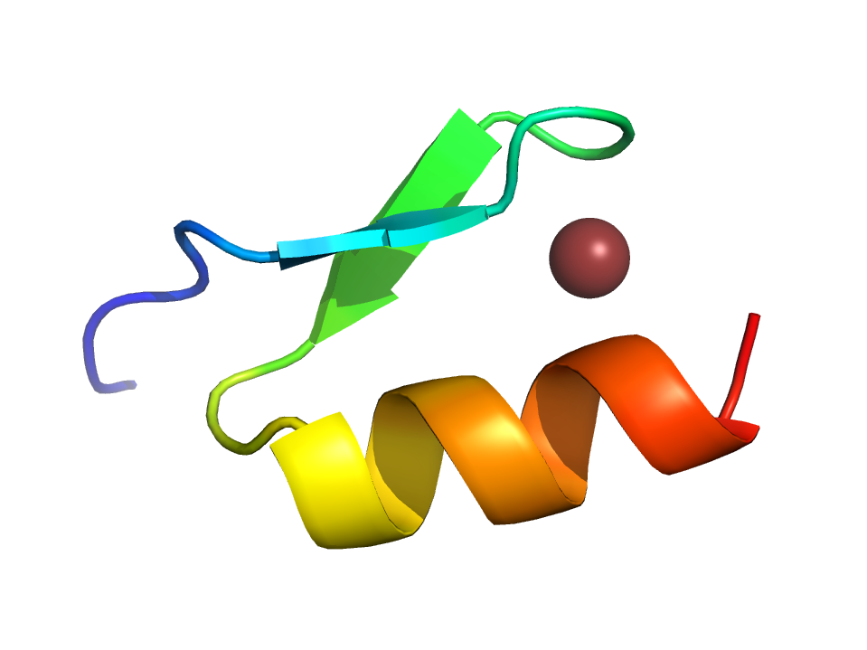
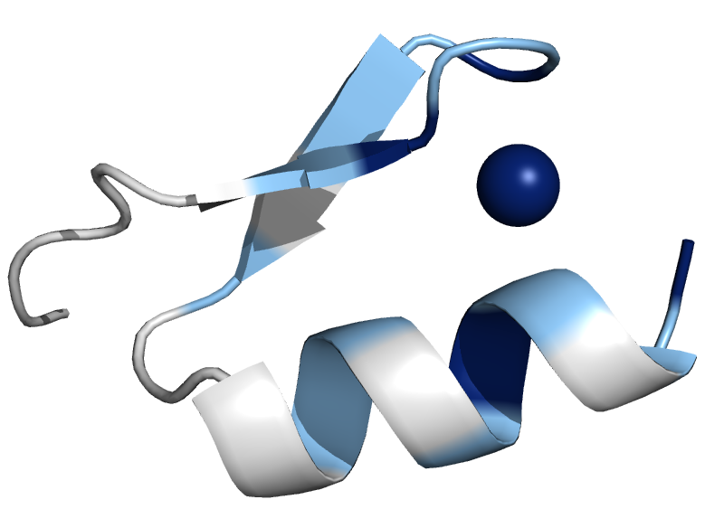

# Geometry Optimization using RosettaQM

## Summary
In this tutorial, we are going to give an example of geometry optimization for a protein. 

## Tutorial
In this case, we have part of a zinc-finger protein. We want to optimize the geometry of protein:
* in proximity of zinc, with quantum mechanics, 
* its neighbourhood with a lower level of theory quantum mechanics, 
* and the rest of protein with Rosetta's energy field. 

<figure align="center">

<figcaption>Figure 1.</figcaption>
</figure>

Therefore, the protein will be seperated into three regions, which will be called reg1, reg2 and reg3, respectively. Then, different movers and scorings will be applied for each reigon. 

Residue selectors ae used to specify each region.`reg1` is selected by residue numbers, and `reg2` is selected by `Neighborhood` selector. This selector compares the distance between beta carbons of selection (in this case, `reg1`) with beta carbons of other residues. If the distance is less than or equal to the threshold (in this case, 4A) it selects that residue. The `include_focus_in_subset="false"` tag means `reg2` excludes `reg1`. Figure 2. highights `reg1` with dark blue, and `reg2` with light blue. `reg3` is selected as anything not in `reg1` or `reg2` regions. 

```
<RESIDUE_SELECTORS>
    <Index name="reg1" resnums="8,11,24,28,29"/>
    <Neighborhood name="reg2" selector="reg1" distance="4.0" include_focus_in_subset="false" />
    <Not name="reg3" selector="reg1,reg2">
</RESIDUE_SELECTORS>
```
<figure align="center">

<figcaption>Figure 2.</figcaption>
</figure>

For each region, a different score function needs to be used. The following table gives a summary of that.

| Region's name | Score function | 
|-------------|----------------|
| reg1 | |
| reg2 | AM1. a semi-empirical score function|
| reg3 | Rosetta ref2015 |


```
<SCOREFXNS>
    <ScoreFunction name="ref2015" weights="ref2015_cart.wts"/>
    <ScoreFunction name="qm_am1" weights="empty" >
        <Reweight scoretype="gamess_qm_energy" weight="1.0" />
        <Set
            gamess_basis_set="AM1" 
            gamess_use_smd_solvent="true"
            gamess_use_scf_damping="false" 
            gamess_max_scf_iterations="50"
            gamess_electron_correlation_treatment="SE"
            gamess_use_h_bond_length_constraints="true"
            gamess_h_bond_length_constraint_force="10" 
            />
    </ScoreFunction>
    <ScoreFunction name="qm_n21" weights="empty" >
        <Reweight scoretype="gamess_qm_energy" weight="1.0" />
        <Set 
            gamess_basis_set="N21"
            gamess_use_smd_solvent="true"
            gamess_use_scf_damping="true"
            gamess_max_scf_iterations="50"
            gamess_electron_correlation_treatment="HF"
            gamess_ngaussian="3" 
            gamess_threads="4"
            gamess_multiplicity="1"
            gamess_npfunc="1" 
            gamess_ndfunc="1"
             />
    </ScoreFunction>
    <ScoreFunction name="qm_n21_hmo" weights="empty" >
        <Reweight scoretype="gamess_qm_energy" weight="1.0" />
        <Set 
            gamess_basis_set="N21"
            gamess_use_scf_damping="true"
            gamess_max_scf_iterations="50"
            gamess_electron_correlation_treatment="HF"
            gamess_ngaussian="3" 
            gamess_threads="4" 
            gamess_multiplicity="1" 
            gamess_fmo_calculation="true" 
            gamess_hybrid_molecular_orbital="3-21G"
            gamess_hybrid_molecular_orbital_file="<path-to-games>/gamess/tools/fmo/HMO/HMOs.txt"
            gamess_max_fmo_monomer_scf_iterations="50"
            />
    </ScoreFunction>
    <MultiScoreFunction name="multi_score_fxn" dump_pdbs="true" >
        <SimpleCombinationRule />
        <Region scorefxn="qm_am1" residue_selector="reg1" >
            <CappedBondResolutionRule/>
        </Region>
        <Region scorefxn="qm_n21_hmo" residue_selector="reg2">
            <CappedBondResolutionRule/>
        </Region>
        <Region scorefxn="r15" >
            <CappedBondResolutionRule/>
        </Region>
    </MultiScoreFunction>

</SCOREFsXNS>
```

```
<SIMPLE_METRICS>
    <TotalEnergyMetric 
        name="gamess_point_energy_subset" 
        scorefxn="multi_score_fxn" 
        custom_type="E_QM_REGIONS_"
    />
</SIMPLE_METRICS>

<MOVERS>
    <GamessQMGeometryOptimizationMover 
        name="qm_geo_opt_msfxn" 
        gamess_threads="4" 
        msfxn_name="multi_score_fxn" 
        msfxn_classical_cartmin="true" 
    />
    
</MOVERS>

<PROTOCOLS>
    <Add mover="qm_geo_opt_msfxn"/>
    <Add metrics="gamess_point_energy_subset"/>
</PROTOCOLS>
```