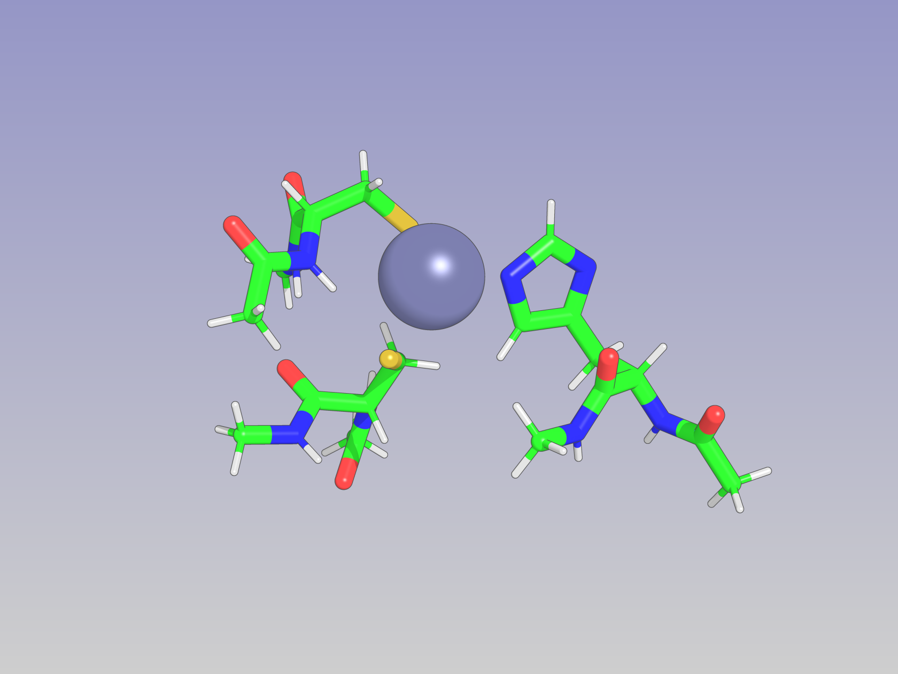

# Geometry Optimization using RosettaQM

## Summary
In this tutorial, we are going to give an example of geometry optimization for a protein.

## Tutorial
In this case, we have part of a zinc-finger protein. We want to optimize the geometry of protein:
* in proximity of zinc, with quantum mechanics,
* its neighbourhood with a lower level of theory quantum mechanics,
* and the rest of protein with Rosetta's score function.

<figure align="center">

<figcaption>Figure 1.</figcaption>
</figure>

Therefore, the protein will be seperated into three regions, which will be called reg1, reg2 and reg3, respectively. Then, different score function will be applied to each reigon with capping rules. And then finally geometry optimization will be applied based on the regions and the capping rules applied for each region.

Residue selectors ae used to specify each region.`reg1` is selected by residue numbers, and `reg2` is selected by `Neighborhood` selector. This selector compares the distance between beta carbons of selection (in this case, `reg1`) with beta carbons of other residues. If the distance i
s less than or equal to the threshold (in this case, 10A) it selects that residue. The `include_focus_in_subset="false"` tag means `reg2` excludes `reg1`. Figure 2. highights `reg1` with dark blue, and `reg2` with light blue. `reg3` is not defined because the MultiScoreFunction will automatically define what is remaining and define that as region 3..


Therefore, the residue selector block looks like this
```
        <RESIDUE_SELECTORS>
        <!-- Define regions of interest -->
        <!-- qm_region1 is the region where the most computationally expensive calculation is going to take place. -->
        <Index name="qm_region1" resnums="8,11,24,28,29"/>
        <!-- qm_region2 is the region where the second most computationally expensive calculation is going to take place. -->
        <!-- Within the Neighborhood qm_region2 defines the region that is within 10.0 from qm_region1 and not including the atoms in qm_region1 (which is done using the tag include_focus_in_subset  -->
        <Neighborhood name="qm_region2" selector="qm_region1" distance="10.0" include_focus_in_subset="false" />
        </RESIDUE_SELECTORS>
```
<figure align="center">

<figcaption>Figure 2.</figcaption>
</figure>

For each region, a different score function needs to be used. The following table gives a summary of that.

| Region's name | Score function |
|-------------|----------------|
| reg1 | |
| reg2 | 
| reg3 | Rosetta ref2015 |


```
        <SCOREFXNS>
            <!-- In order to do multi-scale modeling, we need to set up the different score function that will used for the different regions of your system.  -->

            <!-- Here we define ref15 aka Rosetta's score function -->
            <ScoreFunction name="r15" weights="ref2015_cart.wts"/>
            <!-- Here we define the score function with RosettaQM setting for the most rigorous part aka qm_region1  -->
            <!-- Although note that we don't mention qm_region1 in our score function. That is later.-->
            <ScoreFunction name="qm_hf" weights="empty" >
                <Reweight scoretype="gamess_qm_energy" weight="1.0" />
                <Set gamess_electron_correlation_treatment="HF"
                    gamess_ngaussian="3" gamess_basis_set="N21"
                    gamess_npfunc="1" gamess_ndfunc="1"
                    gamess_threads="%%threads%%" gamess_use_scf_damping="true"
                    gamess_use_smd_solvent="true" gamess_max_scf_iterations="%%scf_iter%%"
                    gamess_multiplicity="1" />
            </ScoreFunction>

            <!-- Here we define the score function with RosettaQM setting for the second rigorous part aka qm_region2  -->
            <!-- Although note that we don't mention qm_region2 in our score function. That is later.-->
            <!-- Also note that here we are using hybrid molecular orbital approx (HMO) -->
            <ScoreFunction name="qm_hf3c_fmo" weights="empty" >
                <Reweight scoretype="gamess_qm_energy" weight="1.0" />
                <Set gamess_electron_correlation_treatment="SE"
                    gamess_basis_set="HF-3C" gamess_use_smd_solvent="true"
                    gamess_use_scf_damping="true"
                    gamess_use_h_bond_length_constraints="true"
                    gamess_h_bond_length_constraint_force="10"
                    gamess_threads="%%threads%%" gamess_max_scf_iterations="%%scf_iter%%"
                    gamess_multiplicity="1" gamess_fmo_calculation="true" gamess_hybrid_molecular_orbital="HF-3c"
                    gamess_hybrid_molecular_orbital_file="/mnt/home/bturzo/ceph/Applications/gamess/tools/fmo/HMO/HMOs.txt"
                    gamess_max_fmo_monomer_scf_iterations="%%scf_iter%%" />
            </ScoreFunction>

            <!-- In the MucltiScoreFunction block is where you tell which region is going to be treated with which level calculation-->
            <!-- Since this a onion layer style calculation dump_pdbs="true" option will dump out all the layers of system that has been defined-->
            <MultiScoreFunction name="msfxn" dump_pdbs="true" >
                <!-- SimpleCombinationRule is how to combine the region. And how to subtract of the energies from each region in order avoid double counting-->
                <!-- There are other more complicated rules but that will not be discussed here and is a treat for another tutorial-->
                <SimpleCombinationRule />
                <!-- CappedBondResolutionRule by default does sensible capping, other capping rules available and can be passed with options-->
                <Region scorefxn="qm_hf" residue_selector="qm_region1" >
                    <CappedBondResolutionRule/>
                </Region>
                <!--Same CappedBondResolutionRule for qm_region2-->
                <Region scorefxn="qm_hf3c_fmo" residue_selector="qm_region2">
                    <CappedBondResolutionRule/>
                </Region>
                <!-- Whatever region is left after qm_region2 automatically gets defined to region3 and is now scored with r15 (as in rosetta score function) -->
                <Region scorefxn="r15" >
                    <CappedBondResolutionRule/>
                </Region>
            </MultiScoreFunction>

        </SCOREFXNS>
```
