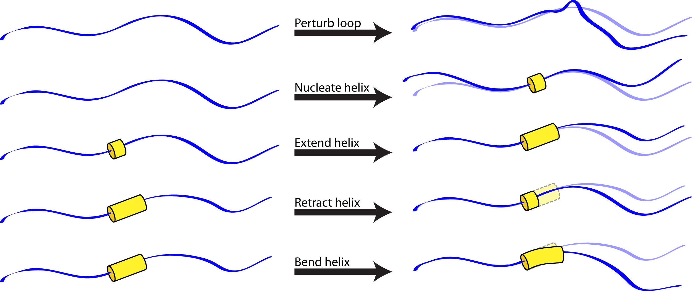
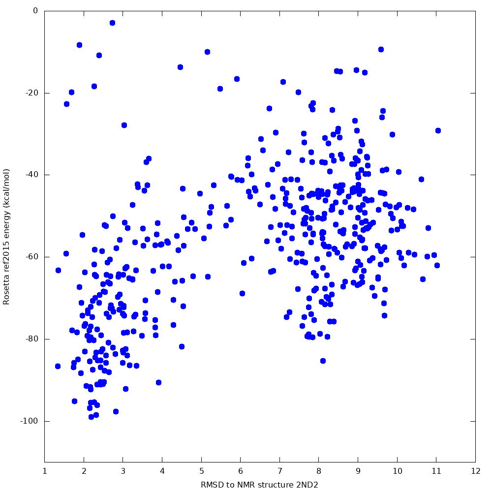
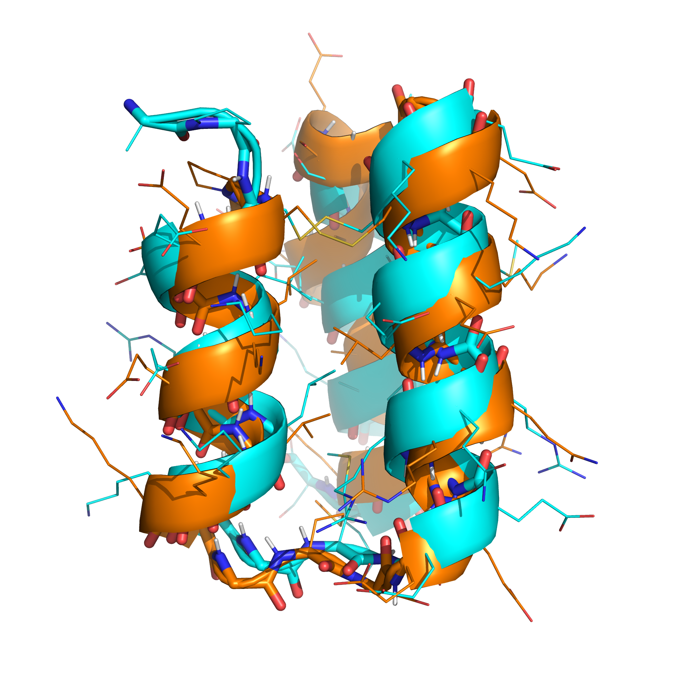

# Fragment-free helical bundle structure prediction using the helical_bundle_predict application

Back to [[Application Documentation]].

Created 21 August 2019 by Vikram K. Mulligan, Flatiron Institute (vmulligan@flatironinstitute.org).  Last updated 22 August 2019.<br/><br/>
<b><i>This application is currently unpublished!  If you use this application, please include the developer in the list of authors for your paper.</i><br/>

[[_TOC_]]

## Description

Rosetta's most widely-used structure prediction application, [[Rosetta ab initio|abinitio-relax]], relies on fragments of proteins of known structure to guide the search of the conformation space, and to limit the conformational search to the very small subset of the space that resembles known protein structures.  This works reasonably well for natural proteins, but prevents the prediction of structures built from non-natural building blocks.  In 2015, we introduced the [[simple_cycpep_predict]] application to allow the prediction of structures of small heteropolymers built from any mixture of chemical building-blocks, without any known template sequences.  The [[simple_cycpep_predict]] application uses the [[generalized kinematic closure|GeneralizedKIC]] algorithm to confine the search to closed conformations of a macrocycle, effectively limiting the search space without relying on databases of known structures.  Unfortunately, this only works for relatively small molecules (less than approx. 15 residues), molecules with regions of known secondary structure (less than approx. 10 residues of loop), or molecules with internal symmetry (less than approx. 8 residues in the repeating unit), and absolutely requires covalent linkage between the ends of the molecule.  A prediction strategy for larger, linear heteropolymers built from non-natural building-blocks is needed.

The helical_bundle_predict application was created to fill this niche.  Based on the hypothesis that fragments are primarily useful for sampling allowed bends of known secondary structures (which can be sampled using [[parametric approaches|MakeBundleMover]], given heteropolymer secondary structures that can be predicted _a priori_) or allowed loop conformations (which can be sampled using random perturbations or [[kinematic approaches|GeneralizedKIC]]), this application carries out a Monte Carlo search of conformation space in which allowed moves include:
- Randomization of a loop position (biased by the Ramachandran map for that residue).
- Small random perturbation of a loop position.
- Nucleation of a turn of helix (using the [[MakeBundle mover|MakeBundleMover]]).
- Elongation of a helical region (with possible merger of two helical regions).
- Contraction of a helical region.
- Small random perturbation of the Crick parameters describing a given helix (using the [[PerturbBundle mover|PerturbBundleMover]]), to allow helices to bend and supercoil.



Note that, because strands are special cases of helices in which the turn per residue is about 180 degrees, this approach should be sufficiently general for any protein or heteropolymer secondary structure.

## Examples

### Predictions using a single core

The default build of Rosetta allows the user to launch an instance of the helical_bundle_predict application which will use one CPU core to compute a trajectory (or, if many trajectories are requested with the `-nstruct` option, many trajectories will be run in sequence).

Let's say that we wanted to predict the structure of a small _de novo_-designed 3-helix bundle miniprotein, such as [PDB ID 2ND2](https://www.rcsb.org/structure/2ND2) (designed by Chris Bahl).  The following commandline would generate 500 sampled structures:

```sh
<path_to_rosetta>/Rosetta/main/source/bin/helical_bundle_predict.default.linuxgccrelease -in:file:fasta inputs/seq.txt -nstruct 500 -in:file:native inputs/2nd2.cif -in:file:fullatom -helical_bundle_predict:helix_assignment_file inputs/2nd2.helix_assignments -helical_bundle_predict:num_steps_per_simulated_annealing_round_centroid 1000 -helical_bundle_predict:num_simulated_annealing_rounds_centroid 5 -out:file:silent output.silent
```

This assumes that in an `inputs/` subdirectory of your working directory, you have a FASTA-formatted sequence file `seq.txt` that contains the sequence of 2ND2, the 2ND2 native structure (`2nd2.cif`), and a helix assignments file (`2nd2.helix_assignments`) specifying the expected helical regions of the structure.  See the *Inputs* section, below, for an example of this file for 2ND2.  Note that the native structure is optional.  Without it, RMSD values to the native will not be calculated.  All sampled structures will be written out to output.silent.

When we tested this protocol, 500 samples produced a lowest-energy sample 2.4 Angstroms from the native, with a clear funnel towards the native state:



The lowest-energy sample (shown in orange, below) had topology closely resembling the native structure (shown in cyan), and the correct disulphide connectivity was found:



### Predictions in parallel on a cluster

Typically, one has many cores available for prediction.  The common way to take advantage of this is to run many independent, parallel instances of Rosetta -- in this case, launching as many copies of the helical_bundle_predict application as one has cores.  This isn't ideal, however, for several reasons:
- Independent instances do not necessarily balance their loads well.  (If the first instance finishes its work in five minutes, and the second instance still has a long list of jobs to carry out, it cannot transfer some of its work to the first.  One core sits idle while another does a lot of work.)
- Independent instances have no ability to carry out analysis on the ensemble of structures generated.  Any analysis must be done after-the-fact.
- Independent instances each load a separate copy of the Rosetta database into memory, potentially preventing all cores from being used on memory-limited systems.
- Independent instances all read from and write to disk independently, potentially resulting in bottlenecks as shared hardware is accessed by many independent processes on large clusters.

The MPI and multi-threaded builds address these problems.

#### Parallelism using Message Passing Interface (MPI) processes

With the MPI build of Rosetta (built by adding `extras=mpi` to the `scons` command during compilation), one can launch many parallel helical_bundle_predict processes.  These processes can then talk to one another, allowing load-balancing, data distribution (reducing disk reads), dedicated output by one process (reducing disk writes), and data analysis over the whole pool of samples.  In MPI mode, the helical_bundle_predict application establishes a hierarchy of MPI processes, in which one emperor processes distributes work to, and collects results from, any number of layers of intermediate master processes, which in turn distribute work to, and collect results from, a large number of slave processes.  The slaves run the same structure prediction algorithm that is run by the single-process version of the application.  During results collection, data analysis is also performed to (a) compute metrics like <b><i>PNear</b></i>, which serves as an estimate of the fraction of time a molecule spends in or near the native state (see Bhardwaj, Mulligan, Bahl _et al_. (2016) _Nature_ 538(7625):329-335 and Hosseinzadeh, Bhardwaj, Mulligan _et al_. (2017) _Science_ 358(6369):1461-1466), and (b) rank the samples by some metric so that only a subset might be written to disk.

To run the MPI version, follow the instructions for your cluster.  Often, the `mpirun` command is used:

```sh
mpirun -np <# of processes> <path_to_Rosetta>/Rosetta/main/source/bin/helical_bundle_predict.mpi.linuxgccrelease @flags.txt`
```

In the above, run options are in the `flags.txt` file.  The `-MPI_batchsize_by_level` and `-MPI_processes_by_level`, documented in the full options list, below, must be included.

#### Parallelism using MPI processes plus threads

Multi-threaded job distribution is also supported.  To enable hybrid process/thread-based parallelism, compile with `extras=cxx11threads,mpi,serialization`.  In the MPI/threaded build, the helical_bundle_predict application sends jobs down an emperor/master/slave hierarchy, as before.  Each slave may launch a number of threads with which to carry out samples in parallel, however (so it is important that each slave receive a batch of jobs larger than the number of worker threads that it has launched).  The number of threads is controlled with the `-threads_per_slave` flag.  Note that one thread will be used for MPI communication and job control, so launching, for example, 8 threads results in 7 worker threads.

## Inputs

### Helix assignment file

Helix locations and Crick parameter sampling options must be provided with an ASCII-formatted helix assignment file.  This is passed to the application with the `helical_bundle_predict:helix_assignment_file` input flag.  Since there are many ways of predicting secondary structure from primary sequence, and of predicting possible helix types given a polymer building block set, it is assumed that some estimates of helix locations and types will be possible to produce and provide as input.  Since the algorithm stochastically nucleates, extends, and retracts helices, the helix types and ranges serve only as a guide; final helix placements may be different.  Also note that strands may be specified, since as noted before they are special cases of helices.  (They are still referred to as "helices" in helix assignment files.)

#### Helix assignment file example

The following shows an example helix assignment file, for predicting PDB ID 2ND2.  The `BEGIN_GLOBALS`...`END_GLOBALS` block specifies that the helical twist (omega0) should be shared by all helices, but the bundle radius (r0) and rotation (delta_omega1) should not.  Helices are not allowed to spread beyond user-defined boundaries, valid twist values range from -3 degrees to +3 degrees, valid bundle radius values range from 5 A to 8 A, and valid rotation values range from 0 to 360 degrees.  All helices are standard alpha helices, defined in the `alpha_helix_100.crick_params` file in the [[Rosetta database|Crick-params-files]].  Monte Carlo moves have a 1% chance of nucleating a helix, a 5% chance of extending a helix, and a 3% chance of retracting a helix.

The helices are then defined in `BEGIN_HELIX`...`END_HELIX` blocks.  The first ranges from position 3 through 3, the second, from position 17 through 30, and the third, from position 32 through 43.  Note that the second and third helices override some of the default parameters defined in the globals section.

```
BEGIN_GLOBALS
        COMMON_OMEGA0 TRUE
        COMMON_R0 FALSE
        COMMON_DELTA_OMEGA1 FALSE
        CONFINE_TO_USER_DEFINED_HELICES TRUE
        OMEGA0_MIN -3
        OMEGA0_MAX 3
        R0_MIN 5
        R0_MAX 8
        DELTA_OMEGA1_MIN 0
        DELTA_OMEGA1_MAX 360
        CRICK_PARAMS_FILE alpha_helix_100.crick_params
        NUCLEATION_PROB 0.01
        EXTENSION_PROB 0.05
        RETRACTION_PROB 0.03
END_GLOBALS

BEGIN_HELIX
        START_RES 3
        END_RES 13
END_HELIX

BEGIN_HELIX
        START_RES 17
        END_RES 30
        R0_MIN 6
        R0_MAX 7
        DELTA_OMEGA1_MIN 45
        DELTA_OMEGA1_MAX 135
END_HELIX

BEGIN_HELIX
        START_RES 32
        END_RES 43
        NUCLEATION_PROB 0.02
        EXTENSION_PROB 0.03
        RETRACTION_PROB 0.01
END_HELIX
```

#### Helix assignment file format

##### Comments and whitespace

Comment lines may be included using a pound sign (#).  Anything following a pound sign is ignored.  All whitespace is treated equally within a line (_i.e._ preceding or trailing spaces or tabs have no significance beyond human readability).

##### Globals block

Global settings are defined in a block that begins with `BEGIN_GLOBALS` and ends with `END_GLOBALS`.  Settings defined in the global settings may be overridden on a helix-by-helix basis in the individual helix blocks.

| Setting | Description | Example |
| ------- | ----------- | ------- |
| COMMMON_R0 | Is the value of r0 (the radius of a helix from the bundle axis) shared by all helices, or independent? Note that this cannot be overridden on a helix-by-helix basis. | COMMON_R0 FALSE #Helices have independent r0 |
| COMMMON_OMEGA0 | Is the value of omega0 (the major helical twist) shared by all helices, or independent? Note that this cannot be overridden on a helix-by-helix basis. | COMMON_OMEGA0 TRUE #Helices share omega0 |
| COMMON_DELTA_OMEGA1 | Is the value of delta_omega1 (the rotation of a helix about its own axis) shared by all helices, or independent? (This affects helices with nonzero omega0 values, which follow a corkscrew path through space and for which different faces of the helix could point towards the center of the corkscrew.) Note that this cannot be overridden on a helix-by-helix basis. | COMMON_DELTA_OMEGA1 FALSE #Helices have independent delta_omega1 |
| CONFINE_TO_USER_DEFINED_HELICES | If true, helices cannot extend beyond user-defined helix limits.  Note that this cannot be overridden on a helix-by-helix basis. | CONFINE_TO_USER_DEFINED_HELICES TRUE #User-defined limits are enforced |
| R0_MIN | The minimum radius for a helix from the superhelix axis.  Can be overridden on a helix-by-helix basis. | R0_MIN 3.5 #Minimum radius of 3.5 Angstroms |
| R0_MAX | The maximum radius for a helix from the superhelix axis.  Can be overridden on a helix-by-helix basis. | R0_MAX 7.5 #Maximum radius of 7.5 Angstroms |
| OMEGA0_MIN | The minimum superhelical twist.  Can be overridden on a helix-by-helix basis. | OMEGA0_MIN -3.5 #Minimum superhelical twist of -3.5 degrees |
| OMEGA0_MAX | The maximum superhelical twist.  Can be overridden on a helix-by-helix basis. | OMEGA0_MAX 2.5 #Maximum superhelical twist of +2.5 degrees |
| DELTA_OMEGA1_MIN | The minimum rotation of a helix about its own axis.  Can be overridden on a helix-by-helix basis. | DELTA_OMEGA1_MIN 0 #Minimum axial rotation of 0 degrees |
| DELTA_OMEGA1_MAX | The maximum rotation of a helix about its own axis.  Can be overridden on a helix-by-helix basis. | DELTA_OMEGA1_MAX 360 #Maximum axial rotation of 360 degrees |
| NUCLEATION_PROB | The fractional probability of nucleating a helix as a Monte Carlo move.  Can be overridden on a helix-by-helix basis. | NUCLEATION_PROB 0.01 # 1% chance of nucleating a helix on any given move |
| EXTENSION_PROB | The fractional probability of extending a helix as a Monte Carlo move.  Can be overridden on a helix-by-helix basis. | EXTENSION_PROB 0.05 # 5% chance of growing a helix on any given move |
| RETRACTION_PROB | The fractional probability of retracting a helix as a Monte Carlo move.  Can be overridden on a helix-by-helix basis. | RETRACTION_PROB 0.03 # 3% chance of shrinking a helix on any given move |
| GLOBAL_PERTURBATION_PROB | The fractional probability of doing a global Crick parameter perturbation as a Monte Carlo move.  Cannot be overridden on a helix-by-helix basis. | GLOBAL_PERTURBATION_PROB 0.02 # 2% chance of global Crick parameter perturbations |
| FRACTIONAL_PERTURBATION_MAGNITUDE | The size of perturbations to the global Crick parameters.  Cannot be overridden on a helix-by-helix basis. | FRACTIONAL_PERTURBATION_MAGNITUDE 0.1 # Crick parameters are perturbed by up to 10%. |
| CRICK_PARAMS_FILE | The Crick parameters file defining the type of helix (or strand).  Can be overridden on a helix-by-helix basis. | CRICK_PARAMS_FILE 14_helix.crick_params #A beta-amino acid 14-helix |

##### Individual helix blocks

Settings for individual helices are specified in blocks that begin with `BEGIN_HELIX` and end with `END_HELIX`.

| Setting | Description | Example |
| ------- | ----------- | ------- |
|START_RES| The first residue of the region in which this helix might exist, based on Rosetta numbering (starting at 1). | START_RES 5 #This helix starts somewhere on or after residue 5. |
|END_RES| The last residue of the region in which this helix might exist, based on Rosetta numbering (starting at 1). | END_RES 15 #This helix ends somewhere before or on residue 15. |
| R0_MIN | Minimum value for radius from supercoiling axis.  Overrides any global setting.  Cannot be used with COMMON_R0. | R0_MIN 3.65 # This helix has a minimum radius from the supercoiling axis of 3.65 Angstroms. |
| R0_MAX | Maximum value for radius from supercoiling axis.  Overrides any global setting.  Cannot be used with COMMON_R0. | R0_MAX 8.0 # This helix has a maximum radius from the supercoiling axis of 8.0 Angstroms. |
| OMEGA0_MIN | Minimum value for supercoiling twist.  Overrides any global setting.  Cannot be used with COMMON_OMEGA0. | OMEGA0_MIN -1.0 # This helix has a minimum supercoil of -1.0 degrees. |
| OMEGA0_MAX | Maximum value for supercoiling twist.  Overrides any global setting.  Cannot be used with COMMON_OMEGA0. | OMEGA0_MAX +1.0 # This helix has a maximum supercoil of +1.0 degrees. |
| DELTA_OMEGA1_MIN | Minimum value for the rotation of a helix about its own axis.  Overrides any global setting.  Cannot be used with COMMON_DELTA_OMEGA1. | DELTA_OMEGA1_MIN 45 # This helix has a minimum rotation about its own axis of 45 degrees. |
| DELTA_OMEGA1_MAX | Maximum value for the rotation of a helix about its own axis.  Overrides any global setting.  Cannot be used with COMMON_DELTA_OMEGA1. | DELTA_OMEGA1_MAX 135 # This helix has a minimum rotation about its own axis of 135 degrees. |
| NUCLEATION_PROB | Probability of nucleating a helix in this region on any given Monte Carlo move.  Overrides any global setting. | NUCLEATION_PROB 0.08 # This region has a nucleation probability of 8%.|
| EXTENSION_PROB | Probability of extending a helix in this region on any given Monte Carlo move.  Overrides any global setting. | EXTENSION_PROB 0.02 # This region has a helix-growing probability of 2%.|
| RETRACTION_PROB | Probability of retracting a helix in this region on any given Monte Carlo move.  Overrides any global setting. | RETRACTION_PROB 0.02 # This region has a helix-shrinking probability of 2%.|
| CRICK_PARAMS_FILE | The helix type.  Overrides any global setting. | CRICK_PARAMS_FILE beta_strand.crick_params #This is a beta strand. |

### Full options list

|                        Option |          Default Setting  |Type|  Description            |      
|-------------------------------|---------------------------|----|------------------------|
|                    in:file:fasta |                           | File | Fasta-formatted sequence file. |
|                    in:file:native |                           |   File | Native PDB filename. |
|                       out:nstruct |                         1 |   Int | Number of structures to generate.  (Number of structure prediction attempts) |
|     helical_bundle_predict:helix_assignment_file |                           |   File | A file containing information about the helix types and helical regions within a helical bundle. |
| helical_bundle_predict:<br\>num_steps_per_simulated_annealing_round_centroid |    1000 |   Int| Number of steps in each round of simulated annealing in centroid mode.|
| helical_bundle_predict:<br\>num_simulated_annealing_rounds_centroid |                3 |   Int | Number of rounds of simulated annealing in centroid mode. |
|helical_bundle_predict:centroid_max_temperature |                        50 |   Real| The maximum temperature during simulated annealing rounds in centroid mode. |
|helical_bundle_predict:centroid_min_temperature |                      0.62 |   Real| The minimum temperature during simulated annealing rounds in centroid mode. |
|helical_bundle_predict:do_final_fullatom_refinement | true |   Bool | If true, the initial centroid model is converted to a full-atom model and relaxed with the FastRelax protocol.  Other refinement steps, such as finding disulfides, may also be carried out.  True by default. |
|helical_bundle_predict:fast_relax_rounds | 3 |   Int | The number of rounds of FastRelax that will be applied.  Does nothing if do_final_fullatom_refinement is false.  Set to 3 by default. |
|helical_bundle_predict:find_disulfides | true |   Bool | If true, the full-atom refinement steps include trying disulfide permutations.  Does nothing if do_final_fullatom_refinement is false.  True by default. |
| cyclic_peptide:MPI_processes_by_level |                           | Int vect | The number of processes at each level of the parallel communications hierarchy, used only by the MPI version.  For example, '1 10 100' would mean that one emperor would talk to 10 masters, which would talk to 100 slaves (implying that each master is assigned 10 slaves).  Similarly, '1 100' would mean that one master would talk directly to 100 slaves.  Required for the MPI version. |
| cyclic_peptide:MPI_batchsize_by_level | | Int vect | The number of jobs sent at a time by each communication level to its children.  Given N levels, N-1 values must be specified.  For example, given 3 communications levels, '100 10' would mean that the emperor sends 100 jobs at a time to each master, which sends 10 jobs at a time to each slave.  Must be specified for the helical_bundle_predict application in MPI mode. |
|cyclic_peptide:MPI_sort_by | "energy" |   String| The MPI version of the helical_bundle_predict app has the option of writing out the top N% of solutions.  This determines the sort metric. |
| cyclic_peptide:MPI_choose_highest | false |   Bool | When outputing the top N% of solutions, should I choose the ones with the highest score for the metric chosen (energy, rmsd, hbonds, etc.), or the ones with the lowest?  False by default (chooses lowest). |
| cyclic_peptide:MPI_output_fraction | 1 |   Real | The fraction of total structures that will be written out.  This is used in conjunction with 'MPI_sort_by' to output the top N% of job outputs. For example, '-MPI_output_fraction 0.05 -MPI_sort_by rmsd' means that the 5% of structures with the lowest RMSD values will be written out. |
| cyclic_peptide:MPI_stop_after_time |  |   I| If this option is used, the emperor node will send a stop signal after an elapsed period of time, given in seconds.  Slave jobs currently running will continue, but intermediate masters will not assign any more work.  Useful on HPC clusters with time limits, to ensure that jobs completed are collected at the end.  Unused if not specified. |
| cyclic_peptide:MPI_pnear_lambda | 0.5 |   Real | In MPI mode, a goodness-of-funnel metric is automatically calculated at the end (PNear).  This value may be thought of as the probability, from 0 to 1, of the peptide being in the native conformation at any given time.  The parameter lambda controls the breadth of the Gaussian (in RMSD units -- Angstroms) that is used to determine the extent to which a state is native-like.  Default 0.5 A. |
| cyclic_peptide:MPI_pnear_kbt | 1 |   Real | In MPI mode, a goodness-of-funnel metric  is automatically calculated at the end (PNear).  This value may  be thought of as the probability, from 0 to 1, of the peptide being in the native conformation at any given time.  The parameter kbt is the Boltzmann temperature that determines the extent to which higher energy states are likely to be sampled.  Default 1.0 kcal/mol. |
| cyclic_peptide:threads_per_slave | 1 |   I| In the multi-threaded MPI compilation, this is the number of threads to launch per slave process.  Note that emperor and master-layer processes do not launch threads.  A value of 1 (the default) means that only standard hierarchical process-based parallelism will be used.  In non-MPI or non-threaded compilations, this option is unused. |

## Code organization

### Base protocol

The application is located in `src/apps/pilot/vmullig/helical_bundle_predict` for now, and will be migrated to public apps when fully functional.  The protocol that it runs is located in `src/protocols/helical_bundle_predict`, with classes defined in the `protocols::helical_bundle_predict` namespace.

The main protocol is defined in the `protocols::helical_bundle_predict::HelicalBundlePredictApplication` class, in `src/protocols/helical_bundle_predict/HelicalBundlePredictApplication.hh`.  The MPI/multi-threaded variant (which calls the `HelicalBundlePredictApplication` for individual prediction trajectories) is defined in the `protocols::helical_bundle_predict::HelicalBundlePredictApplication_MPI` class, which derives from the `protocols::cyclic_peptide_predict::HierarchicalHybridJDApplication` base class and uses the same hierarchical MPI/multi-threaded job distribution and results collection system as the [[simple_cycpep_predict application|simple_cycpep_predict]].

### Support classes

A number of support classes are also defined in the `protocols::helical_bundle_predict` namespace, in header files corresponding to the class name.  These include:

* `HBPHelixAssignments` -- Stores the helix assignments for a structure prediction task.  Separate instances of this class are used _both_ for the user-defined helix assignments _and_ for the current helix assignments at a given stage of a trajectory.  Functions to read assignments from disk are included in this class.
* `HBP_MoveGenerator` -- An abstract base class for generating [[ParsedProtocols|ParsedProtocolMover]] representing moves in a Monte Carlo trajectory.
* `HBP_HelixCoilMoveGenerator` -- Generates a [[ParsedProtocol|ParsedProtocolMover]] for a single move in the centroid-mode Monte Carlo trajectory, based on the current state of the pose.  The move is composed of a random mix of loop perturbations, helix nucleations, helix elongations, helix contractions, and helix parameter perturbations (helix bending moves) with probabilities set by the user.  Derived from `HBP_MoveGenerator`.
* `HBP_FinalFullatomRefinementMoveGenerator` -- Generates a [[ParsedProtocol|ParsedProtocolMover]] for final full-atom refinement of a structure, at the end of a centroid-mode conformational sampling trajectory.  Derived from `HBP_MoveGenerator`.
* `HBP_TemperatureScheduleGenerator` -- An abstract base class for classes that generate the temperature schedule for a Simulated Annealing trajectory.
* `HBP_SigmoidalTemperatureScheduleGenerator` -- A class for generating a sigmoidal temperature schedule for a simulated annealing trajectory, derived from `HBP_TemperatureScheduleGenerator`.

## Current limitations

This application was developed to allow non-canonical heteropolymer structure prediction.  At the present time, it has only been tested on proteins.  A current limitation is that initial sampling is carried out in centroid mode, requiring a centroid-mode scoring function that is compatible with the polymer building blocks used.  Since Rosetta's current centroid scoring functions are hard-coded to be specific for canonical amino acids, they cannot be used for non-canonical heteropolymers.

Development of a new, general centroid scoring function is ongoing.

## See also
- [[Rosetta ab initio application|abinitio-relax]] -- Fragment-based protein structure prediction.
- [[Rosetta simple_cycpep_predict application|simple_cycpep_predict]] -- Structure prediction of macrocycles built from canonical or non-canonical building-blocks.
- [[Generalized kinematic closure|GeneralizedKIC]] -- A mover to sample conformations of a closed chain of atoms, without fragments.
- [[MakeBundle mover|MakeBundleMover]] -- A mover that generates a coiled-coil protein or heteropolymer parametrically, using the Crick equations.
- [[PerturbBundle mover|PerturbBundleMover]] -- A mover that alters Crick parameter values to perturb the conformation of a coiled-coil.
- [[BundleGridSampler mover|BundleGridSamplerMover]] -- A mover that grid-samples Crick parameter space to identify favourable coiled-coil conformations.